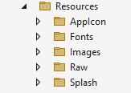

## Part 0 - Overview

Let's start by getting a basic overview of Blazor Hybrid with .NET Multi-platform App UI (MAUI) and how projects are structured. Although we assume that you have a basic understanding of what Blazor is and what .NET MAUI is, we will start with a quick overview of both of these frameworks.

If you feel that you already know about .NET MAUI and/or Blazor, feel free to skip down to [Workshop Project Structure](#workshop-project-structure) where we will start diving into the actual project structure of this workshop.

### Understanding .NET MAUI

.NET MAUI (Multi-platform App UI) is a framework developed by Microsoft that allows developers to create cross-platform applications with a single codebase. It is the evolution of Xamarin.Forms and is part of the .NET ecosystem. With .NET MAUI, you can build native applications for Android, iOS, macOS, and Windows using C# and .NET.

## Key Features of .NET MAUI

1. **Single Project Structure**:
   - **How it works**: .NET MAUI simplifies cross-platform development by providing a single project structure that targets multiple platforms. This means you no longer need to maintain separate projects for each platform.
   - **Benefits**: Streamlines project management, reduces duplication of code, and makes it easier to share resources and assets across platforms.

2. **Native Performance**:
   - **How it works**: .NET MAUI applications are compiled to native code for each platform, ensuring high performance and smooth user experiences.
   - **Benefits**: Leverages the full power of each device, providing a responsive and efficient user interface.

3. **Unified API**:
   - **How it works**: .NET MAUI provides a unified API that allows you to access native device features such as sensors, camera, geolocation, and more from a single codebase.
   - **Benefits**: Simplifies development by providing consistent APIs across platforms, reducing the learning curve and code complexity.

4. **Hot Reload**:
   - **How it works**: .NET MAUI includes a hot reload feature that allows you to make changes to your code and see the results instantly without restarting the application.
   - **Benefits**: Speeds up the development process by providing immediate feedback and reducing the time spent on rebuilding and redeploying the app.

5. **Modern UI Controls**:
   - **How it works**: .NET MAUI offers a comprehensive set of built-in UI controls and layouts, designed to create modern, responsive, and adaptive user interfaces.
   - **Benefits**: Ensures consistency in the look and feel of your applications across different platforms and devices.

6. **Blazor Integration**:
   - **How it works**: .NET MAUI supports Blazor Hybrid, allowing you to embed Blazor components in your .NET MAUI applications. This enables web developers to use Blazor for building the UI while accessing native device features.
   - **Benefits**: Combines the strengths of web and native development, providing flexibility and code reuse.

.NET MAUI is a powerful and versatile framework that simplifies the process of building cross-platform applications. By providing a single project structure, native performance, and a unified API, .NET MAUI enables developers to create high-quality applications for Android, iOS, macOS, and Windows using C# and .NET.

With features like Hot Reload, modern UI controls, and Blazor integration, .NET MAUI offers an efficient and enjoyable development experience. Whether you're a seasoned developer or just starting, .NET MAUI provides the tools and flexibility needed to create stunning and performant cross-platform applications.

There is also a workshop available to build a .NET MAUI app, without Blazor. This workshop is very similar to this one and even builds the same app! This way, you can learn about the similarities and differences between the two approaches: .NET MAUI and Blazor Hybrid. If this is something you're interested in, please also have a look at [the .NET MAUI workshop](https://github.com/dotnet-presentations/dotnet-maui-workshop).

### Understanding Blazor

Blazor is a web framework developed by Microsoft that allows developers to build interactive web applications using C#, without the need for having to write any other language like JavaScript. It is part of the ASP.NET Core family and leverages WebAssembly, enabling C# code to run in the browser. This high-level overview will help you understand the different variations of Blazor with focus on Blazor Hybrid, since that is what we will focus on with this workshop.

#### Different Blazor Hosting Models

The way Blazor is served to the user is called a hosting model. This refers to the way that Blazor is hosted, which can be on a server or directly through the client. Find the different hosting models and a brief description below.

1. **Blazor Server**:
   - **How it works**: Blazor Server runs the application on the server. The user-interface (UI) updates and user interactions are sent to the server over a persistant SignalR connection, and the server sends back the rendered HTML and UI updates.
   - **Benefits**: Faster initial load times, smaller download size since no WebAssembly is needed.
   - **Use cases**: Ideal for apps where real-time updates and quick interactions are crucial, and where server-side processing is preferred.

2. **Blazor WebAssembly (Blazor WASM)**:
   - **How it works**: Blazor WebAssembly runs the application directly in the browser using WebAssembly. The entire app, including the .NET runtime, is downloaded to the client and executed there.
   - **Benefits**: Works offline, no need for continuous server connection, can leverage client resources.
   - **Use cases**: Suitable for creating progressive web apps (PWAs), apps that need to run offline, or when you want to reduce server load.

 As of .NET 8 there is also a mixed mode with which you get granular control over when to use the Server or WebAssembly hosting model on a per-component basis, based on your app needs. However, all of the above is good to know, but not applicable to Blazor Hybrid.

3. **Blazor Hybrid**:
   - **How it works**: Blazor Hybrid allows you to embed Blazor components into native mobile and desktop applications. This is achieved using frameworks like .NET MAUI for cross-platform apps or by embedding Blazor components in existing apps.
   - **Benefits**: Combines the best of web and native development. You can use Blazor for building the UI and access native device capabilities through .NET MAUI.
   - **Use cases**: Ideal for applications that need to run on multiple platforms (Windows, macOS, iOS, Android) and want to share the same codebase between web and native apps.

#### Key Features of Blazor Hybrid

Blazor Hybrid stands out because it bridges the gap between web and native application development. Here's a closer look at why Blazor Hybrid is a compelling choice:

1. **Cross-Platform Development**: With Blazor Hybrid, you can develop applications that run on various platforms using a single codebase written in C#. This approach saves time and effort, as you don't need to maintain separate codebases for web, mobile, and desktop applications. This way you can use C# and .NET end-to-end all the way from your backend to your client.  

2. **Native Performance and Features**: Blazor Hybrid apps can access the full power of the device, including native APIs and features like sensors, file system access, and more. This means you can create highly performant applications that still feel native to the user. The UI components are rendered through the native platform WebViews and are packaged with the app itself so no internet is required. 

3. **Reuse Existing Code**: If you have existing Blazor components or logic, you can reuse them in your Blazor Hybrid applications. This encourages code sharing and reuse, making development more efficient. You put the UI components you want to share across native and web into a Razor Class Library and use interface injection so you can provide different functionality for the different hosting models if needed. Taking your existing Blazor web apps to Blazor Hybrid also allows you to access the App Stores for wider distrubition and reach. 

4. **Modern UI with Blazor**: You can leverage the rich component model of Blazor to build modern, responsive user interfaces. The Blazor framework provides a comprehensive set of UI components and tools to enhance the user experience.

5. **Integration with .NET MAUI**: .NET MAUI is a cross-platform framework that enables Blazor Hybrid development. It allows you to create native applications for Android, iOS, macOS, and Windows using a single project structure and shared codebase.

Blazor is a versatile and powerful framework that opens up new possibilities for web and application development. Whether you're building server-side applications with Blazor Server, client-side applications with Blazor WebAssembly, or cross-platform native apps with Blazor Hybrid, the framework provides the tools and flexibility you need.

Blazor Hybrid, in particular, is an exciting option for developers looking to create modern, cross-platform applications that leverage the strengths of both web and native development. By using Blazor Hybrid, you can deliver a seamless and high-performance user experience across multiple devices and platforms.

For this workshop we are focusing on Blazor Hybrid built on top of .NET MAUI, but Blazor Hybrid is also available for WPF and WinForms.

## Workshop Project Structure

Let's dive a little deeper into the functionalities of Blazor and .NET MAUI by opening the sample project solution for this workshop and inspect all the different elements. For the description and screenshots we will be referring to Visual Studio 2022, but everything you see here is also possible with Visual Studio Code either on Windows or macOS. Things might look and work slightly different there, but should be relatively easy to figure out. If that is not the case, please don't hesitate to reach out.

### Open Solution in Visual Studio

1. Open **Part 1 - Displaying Data/MonkeyFinderHybrid.sln**

This **MonkeyFinderHybrid** solution contains 1 project:

* **MonkeyFinderHybrid** - The main Blazor Hybrid project that targets Android, iOS, macOS, and Windows. It includes all scaffolding for the app including Models, Services, (Maui)Pages and more that we will all explore in this workshop.

<p align="center">
    <picture>
        <source media="(prefers-color-scheme: dark)" srcset="../Art/Solution-dark.png">
        <source media="(prefers-color-scheme: light)" srcset="../Art/Solution-light.png">
        
    </picture>
</p>

The **MonkeyFinderHybrid** project also has blank code files and XAML/Razor pages that we will use during the workshop. All of the code that we modify will be in this project for the workshop.

### Understanding the .NET MAUI single project

Although this workshop focuses on Blazor Hybrid, it's built on top of .NET Multi-platform App UI (.NET MAUI) so it is important to learn about some .NET MAUI concepts as well. Keep in mind that all that is described here, is specific to .NET MAUI and might not be (completely) applicable to Blazor Hybrid. We'll go into some Blazor Hybrid specifics later in this part.

.NET MAUI single project takes the platform-specific development experiences you typically encounter while developing apps and abstracts them into a single shared project that can target Android, iOS, macOS, and Windows.

.NET MAUI single project provides a simplified and consistent cross-platform development experience, regardless of the platforms being targeted. .NET MAUI single project provides the following features:

- A single shared project that can target Android, iOS, macOS, and Windows.
- A simplified debug target selection for running your .NET MAUI apps.
- Shared resource files within the single project.
- Access to platform-specific APIs and tools when required.
- A single cross-platform app entry point.

.NET MAUI single project is enabled using multi-targeting and the use of SDK-style projects in .NET.

#### Resource files

Resource management for cross-platform app development has traditionally been problematic. Each platform has its own approach to managing resources, that must be implemented on each platform. For example, each platform has differing image requirements that typically involves creating multiple versions of each image at different resolutions. Therefore, a single image typically has to be duplicated multiple times per platform, at different resolutions, with the resulting images having to use different filename and folder conventions on each platform.

.NET MAUI single project enables resource files to be stored in a single location while being consumed on each platform. This includes fonts, images, the app icon, the splash screen, and raw assets.

> IMPORTANT:
> Each image resource file is used as a source image, from which images of the required resolutions are generated for each platform at build time.

Resource files should be placed in the _Resources_ folder of your .NET MAUI app project, or child folders of the _Resources_ folder, and must have their build action set correctly. The following table shows the build actions for each resource file type:

| Resource | Build action |
| -------- | ------------ |
| App icon | MauiIcon |
| Fonts | MauiFont |
| Images | MauiImage |
| Splash screen | MauiSplashScreen |
| Raw assets | MauiAsset |

> [!NOTE]
> XAML files are also stored in your .NET MAUI app project, and are automatically assigned the **MauiXaml** build action when created by project and item templates. However, XAML files will not typically be located in the _Resources_ folder of the app project.

When a resource file is added to a .NET MAUI app project, a corresponding entry for the resource is created in the project (.csproj) file. After adding a resource file, its build action can be set in the **Properties** window. The following screenshot shows a _Resources_ folder containing image and font resources in child folders:

<p align="center">
    <picture>
        <source media="(prefers-color-scheme: dark)" srcset="../Art/ResourcesSingleProject-dark.png">
        <source media="(prefers-color-scheme: light)" srcset="../Art/ResourcesSingleProject-light.png">
        
    </picture>
</p>

Child folders of the _Resources_ folder can be designated for each resource type by editing the project file for your app:

```xml
<ItemGroup>
    <!-- Images -->
    <MauiImage Include="Resources\Images\*" />

    <!-- Fonts -->
    <MauiFont Include="Resources\Fonts\*" />

    <!-- Raw Assets (also remove the "Resources\Raw" prefix) -->
    <MauiAsset Include="Resources\Raw\**" LogicalName="%(RecursiveDir)%(Filename)%(Extension)" />
</ItemGroup>
```

The wildcard character (`*`) indicates that all the files within the folder will be treated as being of the specified resource type. In addition, it's possible to include all files from child folders:

```xml
<ItemGroup>
    <!-- Images -->
    <MauiImage Include="Resources\Images\**\*" />
</ItemGroup>
```

In this example, the double wildcard character ('**') specifies that the _Images_ folder can contain child folders. Therefore, `<MauiImage Include="Resources\Images\**\*" />` specifies that any files in the _Resources\Images_ folder, or any child folders of the _Images_ folder, will be used as source images from which images of the required resolution are generated for each platform.

Platform-specific resources will override their shared resource counterparts. For example, if you have an Android-specific image located at _Platforms\Android\Resources\drawable-xhdpi\logo.png_, and you also provide a shared _Resources\Images\logo.svg_ image, the Scalable Vector Graphics (SVG) file will be used to generate the required Android images, except for the XHDPI image that already exists as a platform-specific image.

### App icons

An app icon can be added to your app project by dragging an image into the _Resources\Images_ folder of the project, and setting the build action of the icon to **MauiIcon** in the **Properties** window. This creates a corresponding entry in your project file:

```xml
<MauiIcon Include="Resources\Images\appicon.png" />
```

At build time, the app icon is resized to the correct sizes for the target platform and device. The resized app icons are then added to your app package. App icons are resized to multiple resolutions because they have multiple uses, including being used to represent the app on the device, and in the app store.

#### Images

Images can be added to your app project by dragging them to the _Resources\Images_ folder of your project, and setting their build action to **MauiImage** in the **Properties** window. This creates a corresponding entry per image in your project file:

```xml
<MauiImage Include="Resources\Images\logo.jpg" />
```

At build time, images are resized to the correct resolutions for the target platform and device. The resized images are then added to your app package.

Please note that images are handled differently when using Blazor Hybrid. We will go into this more when we talk about Blazor Hybrid specifically in a minute.

#### Fonts

True type format (TTF) and open type font (OTF) fonts can be added to your app project by dragging them into the _Resources\Fonts_ folder of your project, and setting their build action to **MauiFont** in the **Properties** window. This creates a corresponding entry per font in your project file:

```xml
<MauiFont Include="Resources\Fonts\OpenSans-Regular.ttf" />
```

At build time, the fonts are copied to your app package.

Please note that fonts are handled differently when using .NET MAUI or Blazor Hybrid. The approach as described here is only for .NET MAUI. For Blazor Hybrid you can just provide the font file and reference that from your HTML or CSS.

#### Splash screen

A slash screen can be added to your app project by dragging an image into the _Resources\Images_ folder of your project, and setting the build action of the image to **MauiSplashScreen** in the **Properties** window. This creates a corresponding entry in your project file:

```xml
<MauiSplashScreen Include="Resources\Images\splashscreen.svg" />
```

At build time, the splash screen image is resized to the correct size for the target platform and device. The resized splash screen is then added to your app package.

#### Raw assets

Raw asset files, such as HTML, JSON, and videos, can be added to your app project by dragging them into the _Resources_ folder of your project (or a sub-folder, such as _Resources\Assets_), and setting their build action to `MauiAsset` in the **Properties** window. This creates a corresponding entry per asset in your project file:

```xml
<MauiAsset Include="Resources\Assets\index.html" />
```

Raw assets can then be consumed by controls, as required:

```xml
<WebView Source="index.html" />
```

At build time, raw assets are copied to your app package.

### Understanding .NET MAUI app startup

.NET Multi-platform App UI (.NET MAUI) apps are bootstrapped using the .NET Generic Host model. This enables apps to be initialized from a single location, and provides the ability to configure fonts, services, and third-party libraries.

Each platform entry point calls a `CreateMauiApp` method on the static `MauiProgram` class that creates and returns a `MauiApp`, the entry point for your app.

The `MauiProgram` class must at a minimum provide an app to run, but much more can be configured here like fonts, dependency injection and (third-party) plugins:

```csharp
namespace MyMauiApp;

public static class MauiProgram
{
    public static MauiApp CreateMauiApp()
    {
        var builder = MauiApp.CreateBuilder();
        builder
            .UseMauiApp<App>();

        return builder.Build();
    }
}  
```

The `App` class derives from the `Application` class:

```csharp
namespace MyMauiApp;

public class App : Application
{
    public App()
    {
        InitializeComponent();
    }

    protected override Window CreateWindow(IActivationState? activationState)
	{
		return new Window(new AppShell());
	}
}
```

Please note that the above code shows a .NET MAUI app. For the Blazor Hybrid template there might be slight differences but the concept remains the same as a Blazor Hybrid app is still a .NET MAUI app.

Most notably: in the above code `new AppShell()` is not found when using the Blazor Hybrid template, instead it will create a new instance of type `MainPage` that will host the `BlazorWebView`. More on this later when we learn about Blazor Hybrid specifically.

### Understanding Blazor Hybrid

Now that we understand everything about the .NET MAUI single project, let's see how we can connect Blazor with .NET MAUI and enable the Blazor Hybrid scenario.

Incorporating Blazor into a .NET MAUI app is made possible through a control that is called the `BlazorWebView`. The `BlazorWebView` is just another control in the .NET MAUI toolbox, similar to the regular `WebView`, but specialized in loading Blazor applications.

Actually, it doesn't even have to load full Blazor applications, it can also load parts of Blazor applications, for example just one component. This makes the `BlazorWebView` a very powerful control. You can pick and choose if you want to build your app as a full hybrid app by making your .NET MAUI app one big `BlazorWebView` that loads the whole application in there. Or you can choose to build everything with .NET MAUI and only make one smaller part of your UI a `BlazorWebView` and only reuse that one Blazor component that you already built for the web. In this workshop we'll focus on the full hybrid app scenario.

### Understanding the Blazor Hybrid project

Let's explore the key files and folders that make up a Blazory Hybrid project. If you have worked with a .NET MAUI project and a Blazor project separate from each other before, then this template might look familiar. The Blazor Hybrid template is just like Blazor Hybrid itself: a combination of both.

When you look at the root of the solution you will notice that those files are no different than from a .NET MAUI project. The **MauiProgram.cs** is still the main entry point for our application, which makes sense, because we're still building a .NET MAUI app.

Everything we do here, will still be useable in the Blazor Hybrid context. In fact, there are some extra entries in here by default to enable the usage of Blazor inside of our application. You can see them below.

```csharp
    builder.Services.AddMauiBlazorWebView();

#if DEBUG
    builder.Services.AddBlazorWebViewDeveloperTools();
    builder.Logging.AddDebug();
#endif
```

The first line initializes the `BlazorWebView` for us so that we can start using it inside of our application. Then, only when we create a debug build, we also enable the developer tools.

#### Debugging Blazor Hybrid with browser developer tools

Since some of our code will now run as part of a web view, it might happen that unexpected behavior originates from there. Typically you can recognize this by the gold bar that shows up at the bottom of your Blazor (Hybrid) app that tells you that an unhandled error has occured.

You can inspect the details of such an error with the developer tools inside of your browser. .NET MAUI will use the web view that is native to the platform that it's running on. This means that a browser running the same engine, can connect to the `BlazorWebView` in our application. This is what we enable by calling the `AddBlazorWebViewDeveloperTools()` method as seen above.

In short, with your Blazor Hybrid app connected to your development machine you should be able to open your browser and navigate to `edge://inspect/#devices` (or `chrome://` when using Chrome) and your device/app should show up. You can then click "inspect" and you will see a browser developer tool window with all the details. If you're debugging the Windows machine target, simply hit F12 to open the browser developer tools directly. 

The browser you should use is the one that belongs to the platform. For iOS and macOS this will be Safari and the process above will be slightly different. For Android you can use Chrome or Edge, since Edge runs also on the same underlaying browser engine. And for Windows you should use Edge.

For all the details, please refer to the Microsoft Learn page about using the [browser developer tools with Blazor Hybrid](https://learn.microsoft.com/aspnet/core/blazor/hybrid/developer-tools).

#### Bridging Blazor and .NET MAUI

In the **MonkeyFinderHybrid** project open the **MainPage.xaml**. If you have worked with .NET MAUI before, you would expect to see the default template there with some basic elements defined in XAML. However, for the Blazor Hybrid template, you will see only 1 component in there which is the `BlazorWebView`. 

If you recall from earlier when talking about the **App.xaml.cs**, for a .NET MAUI app, the `MainPage` was set to `AppShell`, but for a Blazor Hybrid app the template creates a new instance of `MainPage`, that is this page.

You can find the full content of the **MainPage.xaml** below for reference.

```xml
<?xml version="1.0" encoding="utf-8" ?>
<ContentPage xmlns="http://schemas.microsoft.com/dotnet/2021/maui"
             xmlns:x="http://schemas.microsoft.com/winfx/2009/xaml"
             xmlns:local="clr-namespace:MonkeyFinderHybrid"
             x:Class="MonkeyFinderHybrid.MainPage"
             BackgroundColor="{DynamicResource PageBackgroundColor}">
             
    <BlazorWebView x:Name="blazorWebView" HostPage="wwwroot/index.html">
        <BlazorWebView.RootComponents>
            <RootComponent Selector="#app" ComponentType="{x:Type local:Components.Routes}" />
        </BlazorWebView.RootComponents>
    </BlazorWebView>

</ContentPage>
```

By just defining the `BlazorWebView` inside of this `ContentPage` it will take up the whole space and we can build our app by the means of Blazor and it will live inside of that `BlazorWebView`. Since Blazor Hybrid shows web content, we will need a webpage to actually host it. The HTML page to use for that is specified in the `HostPage` attribute. If you go look under **wwwroot/index.html**, you will find the actual file there. This is loaded inside of this web view.

Note that the **wwwroot** folder is the equivalent of the web root host folder if this was a web-hosted project. Typically if you reference anything from Razor, the **wwwroot** folder will be the root.

Then, we need to inject our Blazor application inside of that **index.html** file. We do this through the `RootComponent` tag that you see in there. The `Selector` specifies the HTML selector where we will inject our Blazor application. In this case that is a `div` that you can find inside of that **index.html** file.

The `ComponentType` refers to the `Router` component in Blazor. This is basically responsible for bootstrapping the Blazor application. You can find it under **Components/Routes.razor**. And from that moment on, everything will work as you are use to with Blazor. Or, if you don't know Blazor yet, the cool thing is that after this workshop you will now also be able to build Blazor apps on the web!

#### Understanding Blazor Components

During this workshop we will dive more into the specifics of Blazor, but it might be good to establish a bit of understanding on how the different components in the project fit together.

Under the **Components** folder you will find 3 subfolders and 2 Razor files. You can see a screenshot of the expanded folders below.

<p align="center">
    <picture>
        <source media="(prefers-color-scheme: dark)" srcset="../Art/components-overview-dark.png">
        <source media="(prefers-color-scheme: light)" srcset="../Art/components-overview-light.png">
        
    </picture>
</p>

For now we will ignore the **Controls** folder and file in there. This is something we added for this workshop and we will implement at a later stage.

Let's start with the **Components/Routes.razor** that we mentioned just above in the previous section as the starting point for crossing over to Blazor. This specialized Razor component is responsible for mapping the routes to pages and navigation between them. Additionally, if you look inside of this file, you will also see some mentions of "layout".

These references to "layout" refer to the default layout that is used to wrap each Razor page in. In order to not repeat the same markup over and over again, you can define a shared layout file. This is the **Components/Layout/MainLayout.razor**.

If you open this file you can see that this inherits from `LayoutComponentBase` which is needed to be able to use it as a layout. Then you will see the regular mix of Razor syntax and HTML/CSS. With the special `@Body` directive, you will indicate where the contents or a child Razor page is rendered.

Think back to the **index.html** file which has the `<div id="app"></div>` that is used to inject the Blazor application in. This is where the **MainLayout.razor** is injected. Then in turn, any Razor page you navigate to is then injected into that `@Body` directive.

The pages we will show there as content are found under the **Pages** subfolder. We will learn about those during this workshop.

Lastly, the **_Imports.razor** file. This file contains common namespaces and directive that are shared throughout all the Razor pages in this folder. Typically its used to add using statements that are used in multiple Razor pages so you don't have to repeat those. But you can also use other directive in here like `@inject`.

**_Imports.razor** is scoped to the folder it resides in as well as the subfolders underneath it. You can also cascade **_Imports.razor** files by adding them into subfolders.

#### Resources in Blazor Hybrid

Earlier we have read all about how resource files are managed in .NET MAUI. For Blazor Hybrid things are a bit different. For Blazor Hybrid you will want to add your resources in the **wwwroot** folder in the project. This is basically the root of your web application and since we're now shaping the UI through HTML and CSS, it is easiest to manage our resources from there.

For example, if you want to show a static image in your application, you probably want to add an **images*** subfolder under your **wwwroot** folder and you can then simply specify your image like this, assuming the image filename is **myimage.png**: ``.

For other resources, like fonts or JSON files or anything else, the same applies.

Don't worry if you don't understand everything fully, it will become more clear when we start writing some code.

Now that you have a basic understanding of the Blazor Hybrid project, let's start building an app! Head over to [Part 1](../Part%201%20-%20Displaying%20Data/README.md).