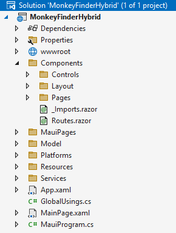
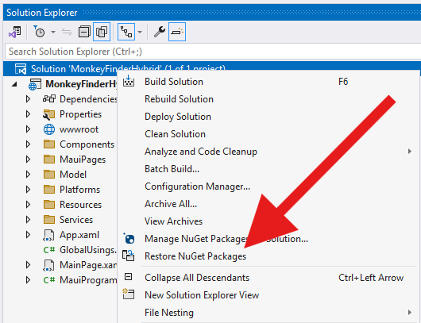
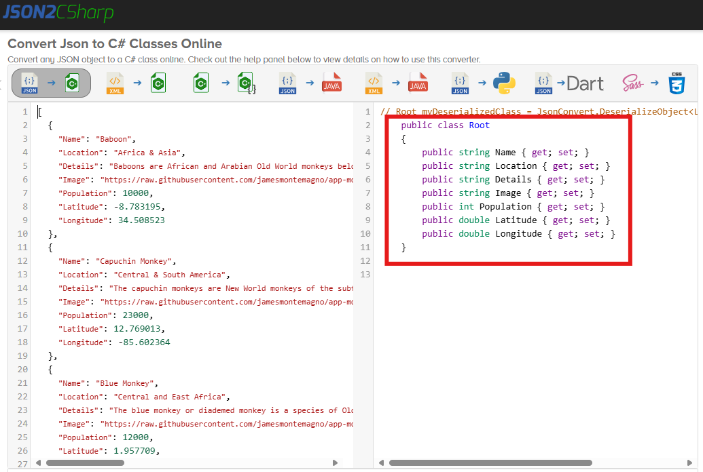
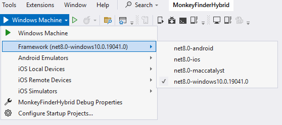
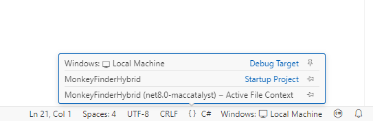
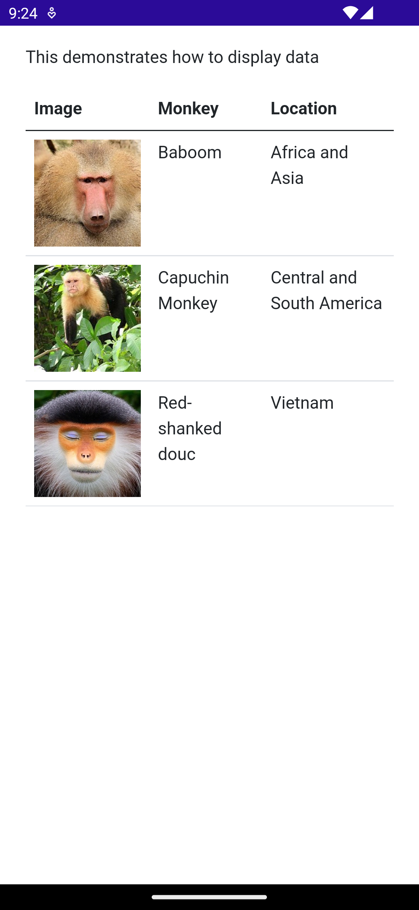
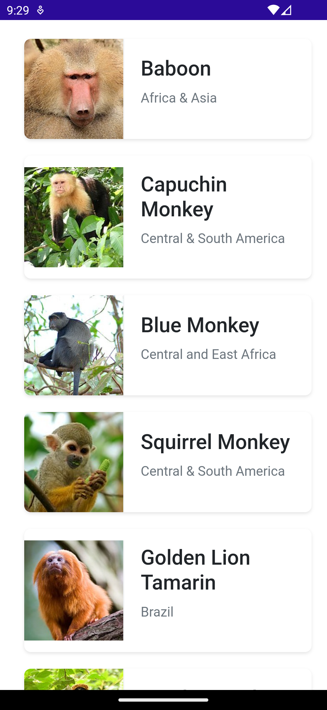

## Displaying Data

In Part 0 you got a basic understanding of what makes up a Blazor Hybrid project, now let's start coding and see how to display a list of data in a table.

### Open Solution in Visual Studio

1. Open **Part 1 - Displaying Data/MonkeyFinderHybrid.sln**

This MonkeyFinderHybrid solution contains 1 project:

* **MonkeyFinderHybrid** - The main Blazor Hybrid project that targets Android, iOS, macOS, and Windows. It includes all scaffolding for the app including Models, Components, Services and wwwroot folders.

<p align="center">
    <picture>
        <source media="(prefers-color-scheme: dark)" srcset="../Art/Solution-dark.png">
        <source media="(prefers-color-scheme: light)" srcset="../Art/Solution-light.png">
        
    </picture>
</p>

The **MonkeyFinderHybrid** project also has blank code files and Razor pages that we will implement and use during the workshop. All of the code that we modify will be in this project for the workshop.

### NuGet Restore

All projects have the required NuGet packages already installed, so there will be no need to install additional packages during the hands on lab. The first thing that we must do is restore all of the NuGet packages from the internet.

Right-click on the solution and select **Restore NuGet packages...**

<p align="center">
    <picture>
        <source media="(prefers-color-scheme: dark)" srcset="../Art/RestoreNuGets-dark.png">
        <source media="(prefers-color-scheme: light)" srcset="../Art/RestoreNuGets-light.png">
        
    </picture>
</p>

If you prefer to use the command-line, or you use VS Code, run `dotnet restore` from a terminal window in the folder where the project is located on disk.

Each part has its own starting point project, that will have all the NuGets for that part. If you decide to start from the project in this Part 1 and just keep building on that, you do need to install some NuGet packages. Those will be pointed out as necessary.

### Monkey Model

We will be downloading details about the monkeys we find and therefore we will need a class to represent a monkey.

<p align="center">
    <picture>
        <source media="(prefers-color-scheme: dark)" srcset="../Art/Convert-dark.png">
        <source media="(prefers-color-scheme: light)" srcset="../Art/Convert-light.png">
        
    </picture>
</p>

We can easily convert our JSON file located at [montemagno.com/monkeys.json](https://montemagno.com/monkeys.json) by using [json2csharp.com](https://json2csharp.com) and pasting the raw JSON into json2csharp to generate our C# classes. From the resulting C# code, copy all the properties in there and go back to Visual Studio.

1. With the **MonkeyFinderHybrid** solution still opened in Visual Studio, go to the **Model/Monkey.cs** file and paste the properties inside the `Monkey` class that is already there.

    If you copied the whole class that's fine too, just ensure that you rename `Root` to `Monkey` and make the namespace `namespace MonkeyFinderHybrid.Model;` in the top of the file.

1. Visual Studio will show us some warnings because the `string` properties can be null and we don't want that for our project. Let's initialize them with a default value of `string.Empty`.

    The end result will look like this:

    ```csharp
    namespace MonkeyFinderHybrid.Model;

    public class Monkey
    {        
        public string Name { get; set; } = string.Empty;
        public string Location { get; set; } = string.Empty;
        public string Details { get; set; } = string.Empty;
        public string Image { get; set; } = string.Empty;
        public int Population { get; set; }
        public double Latitude { get; set; }
        public double Longitude { get; set; }
    }
    ```

Additionally, because we will be using `System.Text.Json` to deserialize the data, we will want to add a `MonkeyContext` that will dynamically generate code for better performance. The following code will enable this and we will use it in the future.

Add this also in the **Monkey.cs** under the `Monkey` class.

```csharp
// This using statement needs to go in the top of the Monkey.cs file
using System.Text.Json.Serialization;

// Make sure that this is outside of the Monkey class
[JsonSerializable(typeof(List<Monkey>))]
internal sealed partial class MonkeyContext : JsonSerializerContext
{

}
```

By default, reflection is used to determine the metadata for an object that needs to be serialized and deserialized with JSON. By enabling the above, we instead use source generation to do this. This will speed up our application and make it compatible with ahead-of-time compilation.

The inner workings of this are out of scope for this workshop, if you want to learn more, please have a look at the [documentation page](https://learn.microsoft.com/dotnet/standard/serialization/system-text-json/source-generation) for this functionality.

### Displaying Data

To get a feeling for how to compose a user-interface, let's first display some hard coded data in a table in our **Components/Pages/Home.razor**. This will allow us to build out our user interface by setting the table rows with some simple images and labels. We first need to create a list variable and add some placeholder data to display in the table. 

The default Razor language is HTML. Rendering HTML from Razor markup is no different than rendering HTML from an HTML file. Razor supports C# and uses the `@` symbol to transition from HTML to C#. Razor evaluates C# expressions and renders them in the HTML output.

In the `@code` section of **Home.razor**, add the following:

```csharp
@code {
    private List<Monkey> monkeys = new();

    protected override async Task OnInitializedAsync()
    {     
        // Add some monkeys manually
        monkeys.Add(new Monkey { Name = "Baboon", Image="https://raw.githubusercontent.com/jamesmontemagno/app-monkeys/master/baboon.jpg", Location="Africa and Asia" });

        monkeys.Add(new Monkey { Name = "Capuchin Monkey", Image = "https://raw.githubusercontent.com/jamesmontemagno/app-monkeys/master/capuchin.jpg", Location = "Central and South America" });

        monkeys.Add(new Monkey { Name = "Red-shanked douc", Image = "https://raw.githubusercontent.com/jamesmontemagno/app-monkeys/master/douc.jpg", Location = "Vietnam" }); 
    }
}
```

This will provide us with a list of data to display. In the section above the `@code` block, we can add the HTML code for the UI.

Add the following into the **Home.razor**, above the `@code` block, make sure that you keep the `@page` directive in place:

```html
<div>
    <p>This demonstrates how to display data</p>
  
    <table class="table">
        <thead>
            <tr>
                <th>Image</th>
                <th>Monkey</th>
                <th>Location</th>
            </tr>
        </thead>
        <tbody>
            @foreach (var monkey in monkeys)
            {
            <tr>
                <td>
                    
                </td>
                <td>@monkey.Name</td>
                <td>@monkey.Location</td>
            </tr>
            }
        </tbody>
    </table>  
</div>
```

### Run the App

Setting up your development environment for Blazor Hybrid, or rather .NET MAUI, is outside of the scope of this workshop, hopefully you have already done that successfully before joining this workshop. If not, please have a look at [the documentation](https://learn.microsoft.com/dotnet/maui/get-started/installation). Both Visual Studio 2022 and Visual Studio Code installation steps are described there.

Below we will provide a brief overview of how to ensure that everything is configured correctly and how to start debugging the project.

#### Visual Studio 2022

If you are running on Windows, deploying our project to typically has the fastest feedback loop. Because of Blazor Hybrid's cross-platform nature you can also switch to Android easily. For getting started, we recommend deploying to Windows. The screenshots in this workshop will show you what it looks like when deployed to Android.

* [Windows setup for development](https://learn.microsoft.com/dotnet/maui/windows/setup)
* [Android Emulator Setup](https://learn.microsoft.com/dotnet/maui/android/emulator/device-manager)

1. In Visual Studio, set the Windows app as the startup project by selecting the drop down in the debug menu (the down arrow next to the green play button) and changing the `Framework`. You can see this in the screenshot below.

<p align="center">
    <picture>
        <source media="(prefers-color-scheme: dark)" srcset="../Art/SelectFramework-dark.png">
        <source media="(prefers-color-scheme: light)" srcset="../Art/SelectFramework-light.png">
        
    </picture>
</p>

1. To start a debugging session and run the application, click the "Debug" (the green play button) button or go to Tools -> Start Debugging

> [!NOTE]
> If you are having any trouble, see the setup guides (linked above) for your runtime platform.

#### Visual Studio Code

In VS Code, when you have the .NET MAUI extension installed, you will see an icon with curly braces in the bottom bar. If you click that, you will see the menu as shown in the screenshot below.

<p align="center">
    <picture>
        <source media="(prefers-color-scheme: dark)" srcset="../Art/VSCodeDebugMenu-dark.png">
        <source media="(prefers-color-scheme: light)" srcset="../Art/VSCodeDebugMenu-light.png">
        
    </picture>
</p>

Here you can select the debugging target, the startup project and can see the active file context. For easier access, click one of the pins behind an option to pin it to the bottom bar. If you're running on a Mac, you probably want to deploy to macOS for the fastest development loop.

Running the app will result in a list of three monkeys, below you can see the result when running the app on Android:

<p align="center">
    <picture>
        <source media="(prefers-color-scheme: dark)" srcset="../Art/CodedMonkeys-dark.png">
        <source media="(prefers-color-scheme: light)" srcset="../Art/CodedMonkeys-light.png">
        
    </picture>
</p>

Let's take this a step further and load the monkeys list using a service from the internet.

### Create a Monkey Service

We are ready to create a method that will retrieve the monkey data from the internet. We will first implement this with a simple HTTP request using `HttpClient`. We will do this inside of our **Services/MonkeyService.cs** file.

1. Inside of the **MonkeyService.cs**, let's add a new method to get all monkeys:

    ```csharp
    private List<Monkey> monkeyList = new();

    public async Task<List<Monkey>> GetMonkeys()
    {
        return monkeyList;
    }
    ```

    Right now, the method simply creates a new list of `Monkey` and returns it. We can now fill in the method use `HttpClient` to pull down a JSON file, parse it, cache it, and return it.

1. Let's get access to an `HttpClient` by added into the contructor for the `MonkeyService`.

    ```csharp
    private readonly HttpClient httpClient;
    
    public MonkeyService()
    {
        httpClient = new HttpClient();
    }
    ```

    Blazor Hybrid (or rather .NET MAUI) includes dependency injection similar to ASP.NET Core. We will register this service and dependencies soon. If you have worked with ASP.NET before, this all should look very familiar.

1. Let's check to see if we have any monkeys in the list already and return it if so by filling in the `GetMonkeys()` method:

    ```csharp
    if (monkeyList.Count > 0)
    {
        return monkeyList;
    }
    ```

    This way we will cache our already retrieved monkeys. If we have retrieved the data from remote before, this list will still have values and be returned immediately. In real-world scenarios you will probably want to implement ways to force a refresh of the data, either manually or by checking to see if the data might be outdated. Additionally, this caching only works for the duration of the app running. Whenever the app is closed, this cache will be cleared. Depending on your needs, you might want to consider caching more persistent. For this workshop, this is out of scope.

1. Just below the piece of code from the previous step, lets use the `HttpClient` to make a web request and parse it using the built-in `System.Text.Json` deserialization.

    ```csharp
        var response = await httpClient.GetAsync("https://www.montemagno.com/monkeys.json");
        if (response.IsSuccessStatusCode)
        {
            var resultMonkeys = await response.Content.ReadFromJsonAsync(MonkeyContext.Default.ListMonkey);

            if (resultMonkeys is not null)
            {
                monkeyList = resultMonkeys;
            }
        }
    ```

1. Add the following using directive at the top of the file to access the `ReadFromJsonAsync()` extension method:

    ```csharp
    using System.Net.Http.Json;
    ```

#### No Internet? No Problem!

If you have limited access to the internet right now, don't worry as we have embedded a list of monkeys into the project as well! Instead of using `HttpClient`, you can read the file with the code below from the embedded resourced and return that to be our list of monkeys:

```csharp
using var stream = await FileSystem.OpenAppPackageFileAsync("monkeydata.json");
using var reader = new StreamReader(stream);
var contents = await reader.ReadToEndAsync();
monkeyList = System.Text.Json.JsonSerializer.Deserialize(contents, MonkeyContext.Default.ListMonkey);
```

The **monkeydata.json** is added to the **Resources/Raw** folder and because of that is embedded as a resource we can use at runtime in our app. If you remember from Part 0, the **Resources** folder is on the .NET MAUI side of this project. This illustrates that we can use that in our Blazor Hybrid application without any problems!

Make sure to keep only this block of code or the block where you retrieve it from online to prevent unexpected things from happening.

### Register Services

Before we can run the app, we must register all of our dependencies in the dependency injection container. To do this, open the **MauiProgram.cs** file. 

1. Find where we are registering our `AddMauiBlazorWebView()` with `builder.Services` and add the following below it on a new line:
	```csharp
	builder.Services.AddSingleton<MonkeyService>();
	```

We are registering the `MonkeyService` as a singleton. This means they will only be created once during the lifecycle of our application, if we wanted a unique instance to be created each request we would register them as `Transient`.

While `Scoped` is supported within Blazor Hybrid/.NET MAUI it is of limited use and outside of the scope of this workshop.

### Call `MonkeyService` from **Home.razor**

We now can update our **Home.razor** to call our new monkey service and expose the list of monkeys to our user interface. After services are added to the service collection, inject one or more services into components with the `@inject` Razor directive, which has two parameters:

- **Type:** The type of the service to inject.
- **Property:** The name of the property receiving the injected app service. The property doesn't require manual creation. The compiler creates the property, you just give the variable name here that you want to reference the instance by later.

1. In the **Home.razor**, let's inject the `MonkeyService` at the top of the file:

    ```html
    @inject MonkeyService monkeyService
    ```

1. Then in the `@code` section, let's update the code to use the Service instead of the manual list:

    ```csharp
    private List<Monkey> monkeys = new();

    // OnInitializedAsync is a built-in lifecycle event that is called when this page is initialized
    protected override async Task OnInitializedAsync()
    {
        // Load monkeys from MonkeyService
        monkeys = await monkeyService.GetMonkeys();
    } 
    ```

Our main method for getting data is now complete! Let's move on to making the list of monkeys better looking.

## Build The Monkeys User Interface

It is now time to build the .NET MAUI Blazor Hybrid user interface in **Home.razor**. Our end result is to build a page that looks like this:

<p align="center">
    <picture>
        <source media="(prefers-color-scheme: dark)" srcset="../Art/FinalUI-dark.png">
        <source media="(prefers-color-scheme: light)" srcset="../Art/FinalUI-light.png">
        
    </picture>
</p>

In **Home.razor**, we will update the UI to use a list and display the `Image` on the left and the `Name` and `Location` on the right. 

In the existing `<div>` that we added earlier to **Home.razor**, replace the existing code with the following code:

```html
@if (monkeys is null)
{
    <p><em>Loading...</em></p>
}
else
{
    <ul class="card-list">
        @foreach (var monkey in monkeys)
        {
            <li class="card-item">
                
                <div class="card-content">
                    <h2>@monkey.Name</h2>
                    <p>@monkey.Location</p>
                </div>
            </li>
        }
    </ul>
}
```

This code first checks if the list of monkeys is null, and when it is it will show a simple HTML string that indicates to the user that we are loading our data.

The else clause of this if-statement will do the opposite: it will show an HTML unordered list (`<ul>`) and inside of that we loop through the monkeys in the data we retrieved and for each we print out the HTML that will show each of the monkeys.

Blazor Hybrid, just like Blazor, uses [Bootstrap](https://getbootstrap.com/) by default, so to make things look pretty we can use the built-in CSS classes like `card-list` and `card-item`.

What is cool about this is that `monkeys is null` is evaluated automatically when the value changes. Initially the page will show the loading message, then when the monkey data is retrieved from our service and assigned to the `monkeys` variable the page automatically refreshes and shows the data.

If loading the data goes too fast, add some artificial delay to your code so you can better see it. In the `OnInitializedAsync()` add a delay to make the loading indicator more clear. Obviously you don't want to do this in production code.

```csharp
protected override async Task OnInitializedAsync()
{
    // This was added
    // Simulate asynchronous loading to demonstrate a loading indicator
    await Task.Delay(500);

    // Load monkeys from MonkeyService
    monkeys = await monkeyService.GetMonkeys();
}
```

### Run the App

1. In Visual Studio (Code), set the iOS, Android, macOS, or Windows project as the startup project, you choose whichever you like!

    For quick iterations it is usually fastest to deploy to Windows when developing on Windows. Same goes for macOS. Depending on your primary target platforms, you do of course want to test on those regularly as well.

2. After that, click "Start Debugging". When the application starts you will see the page load monkey data from the internet!

Let's continue our journey and learn about adding new monkeys in [Part 2](../Part%202%20-%20Add%20Monkey%20Dialog/README.md)
