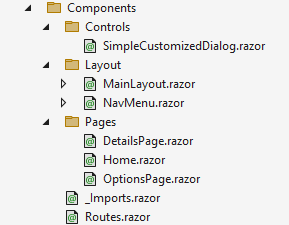
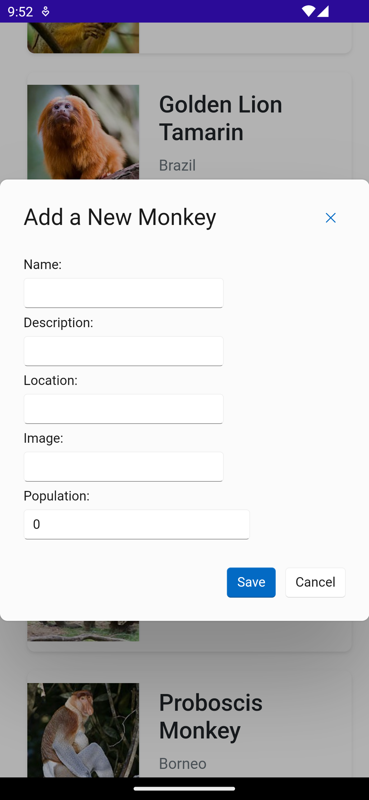

## Add New Monkeys

In Part 1, we used the `MonkeyService` to retrieve the data and then show the monkeys in a list on screen. Now let's see how we can create a dialog to add a monkey to the list manually.

By doing this we will learn how to use (third-party) reusable components in our own project, as well as how to not only read data, but also create new entries.

### Event Handling in Razor

We can specify delegate event handlers in Razor markup and call the method in the C# code. We will use this to implement the functionality to add a new monkey record to our existing data.

In the **Home.razor**, let's add a button to show the Add New Monkey dialog. We will add a method to the `onclick` event of the HTML button component. Add the button element to the **Home.razor** file, between the opening `<div>` tag and the `@if` statement that are already there: 

```html
<div>
    <button class="button-yellow" @onclick="AddMonkey">Add New Monkey</button>

    @if (monkeys is null)
    {
        <p><em>Loading...</em></p>
    }
    else
    {
        <ul class="card-list">
        <!-- ... Rest of the content is omitted -->
    }
```

In Blazor each JavaScript event handler has an equivalent that allows you to wire it up with C# code. For example, in the above code the `onclick` event is something that is available in HTML/JavaScript and you can hook it up to JavaScript code to add some functionality. By adding the `@` sign in front of it, you will be able to hook it up to a C# method instead.
    
As a general rule you can prefix each JavaScript event handler with the `@` sign followed by the HTML/JavaScript name for the event. For more information on this, please refer to this [Microsoft Learn page](https://learn.microsoft.com/aspnet/core/blazor/components/event-handling).

In the `@code` section of the **Home.razor** page, let's add a `Debug` statement to check the button click event and see that it actually works. 

```csharp
private void AddMonkey()
{
    // MAUI Debug console
    Debug.WriteLine("Add Monkey");
}
```

Now run the code, and tap the button to see the message in the `Debug` window. In Visual Studio and Visual Studio Code you can bring up the Output pane by going to View and then Output. In the pane that comes up make sure that in the dropdown Show output from, Debug is selected.

Look closely, there might be a lot of text in there, but when you click the button, it should also show "Add Monkey" in there.

### Fluent UI Blazor Components

To create the dialog with the entry fields, we will use the [Fluent UI Blazor Components](https://fluentui-blazor.net/#getting-started) library. This plugin provides everything to quickly and easily implement Microsofts [Fluent Design System](https://developer.microsoft.com/fluentui#/) in your own application. It provides controls that you can use, as well as ways to make it easier to add the Fluent design to your existing controls.

Of course its not strictly necessary to use this, you can also use a regular page or some other way to capture the details of our new monkey, but by adding this we're learning yet another thing!

You can install the Fluent UI Blazor Components library to your project by simply adding the `Microsoft.FluentUI.AspNetCore.Components` NuGet package to your project. For this workshop this NuGet package has already been added to the project.

Additionally, we have added the required `@using Microsoft.FluentUI.AspNetCore.Components` statement to the **_Imports.razor** file for this project. If you have been following along with your own project, make sure to add that as well, or add this `@using` directive in all pages where you use the Fluent UI Blazor Components.

Let's continue by configuring the project to use these Fluent UI components. 

Find the **wwwroot** folder, with the **index.html** file inside:

<p align="center">
    <picture>
        <source media="(prefers-color-scheme: dark)" srcset="../Art/wwwroot-dark.png">
        <source media="(prefers-color-scheme: light)" srcset="../Art/wwwroot-light.png">
        
    </picture>
</p>

1. Open the **index.html** file and find the below line

    ```html
    <script src="_framework/blazor.webview.js" autostart="false"></script>
    ```

    Right above this line, add the initialization line for the Fluent UI Blazor library as seen below. You want to make sure that the value of the `app-name` attribute matches the assembly name of your application. Typically this is the same as the name of your C# project, in our case MonkeyFinderHybrid.

    ```html
    <script app-name="MonkeyFinderHybrid" src="./_content/Microsoft.FluentUI.AspNetCore.Components/js/initializersLoader.webview.js"></script>
    <script src="_framework/blazor.webview.js" autostart="false"></script>
    ```

1. In **MauiProgram.cs**, we're going to add a call to the `AddFluentUIComponents()` method which will initialize the components in this library. To do this, add the following line:

    ```csharp
    // This line is already there
    builder.Services.AddMauiBlazorWebView();

    // Add this one right below
    builder.Services.AddFluentUIComponents();
    ```

That's it! We can now start using the Fluent UI Components in our app.

This is a very common pattern for libraries to use. Install the NuGet, initialize through a line of code in the **MauiProgram.cs** and you're ready to go. Not all libraries need it, or maybe more is needed. Always check the documentation!

> [!NOTE] 
> If you hit errors, try a clean and rebuild on the project!

### Creating the Dialog

The Fluent UI Blazor library has a lot of great components. For our app we will be using the [Dialog](https://fluentui-blazor.net/Dialog#customizeddialog) component to create a form to add a new monkey to the list. 

1. In the **Components/Controls** folder, add the following code to the **SimpleCustomizedDialog.razor** file:

    ```html
    @implements IDialogContentComponent<Monkey>

    @* Header *@
    <FluentDialogHeader ShowDismiss="true">
        <FluentStack VerticalAlignment="VerticalAlignment.Center">
            <FluentLabel Typo="Typography.PaneHeader">
                @Dialog.Instance.Parameters.Title
            </FluentLabel>
        </FluentStack>
    </FluentDialogHeader>

    @* Body *@
    <FluentDialogBody>
        <FluentTextField @bind-Value="@Content.Name">Name:</FluentTextField>
        <FluentTextField @bind-Value="@Content.Details">Description:</FluentTextField>
        <FluentTextField @bind-Value="@Content.Location">Location:</FluentTextField>
        <FluentTextField @bind-Value="@Content.Image">Image:</FluentTextField>
        <FluentNumberField @bind-Value="@Content.Population">Population:</FluentNumberField>
        <FluentNumberField @bind-Value="@Content.Latitude">Latitude:</FluentNumberField>
        <FluentNumberField @bind-Value="@Content.Longitude">Longitude:</FluentNumberField>
    </FluentDialogBody>

    @* Footer *@
    <FluentDialogFooter>
        <FluentButton Appearance="Appearance.Accent" OnClick="@SaveAsync">Save</FluentButton>
        <FluentButton Appearance="Appearance.Neutral" OnClick="@CancelAsync">Cancel</FluentButton>
    </FluentDialogFooter>

    @code {
        [Parameter]
        public Monkey Content { get; set; } = default!;

        [CascadingParameter]
        public FluentDialog Dialog { get; set; } = default!;

        private async Task SaveAsync()
        {
            await Dialog.CloseAsync(Content);
        }

        private async Task CancelAsync()
        {
            await Dialog.CancelAsync();
        }
    }
    ```

    What we just did is create a customized version of the default Fluent UI Blazor library `Dialog`. By specifying the `@implements` Razor directive we make this Razor component implement an interface without using a code-behind file. In the `@code` block you will then implement the necessary interface members.

    By overriding the `FluentDialogHeader`, `FluentDialogFooter` and `FluentDialogBody` you can customize the look and feel of the dialog.

    The markup code is mostly all Fluent UI Blazor components that will make up a form to add the details for a new monkey that you want your users to add at runtime. We'll see that in a little bit when we run the app to inspect the final result.

    In the `@code` block we see mostly just C# code that you will recognize, but 2 things stand out: the `Parameter` and `CascadingParameter` attributes.

    With the `Parameter` attribute you can enable this property to be set from externally. This makes the `SimpleCustomizedDialog` more reusable as we can now provide the monkey data to this component and work with it.

    The `CascadingParameter` works similar, but is used to capture values set on ancestor components. The actual workings of this attribute is beyond the scope of this workshop but you can learn more about it [here](https://learn.microsoft.com/aspnet/core/blazor/components/cascading-values-and-parameters).

2. In the **Components/Layout/MainLayout.razor** file, add the following to register the `FluentDialogProvider`:

    ```html
    <FluentDialogProvider />
    ```

    This is a specific concept to the Fluent UI Blazor components to make sure that dialogs show up in the correct way.

3. Now in the **Home.razor** file, we are ready to connect the dialog to the `Add New Monkey` button. In the `@code` block, let's update the `AddMonkey()` method to display our newly created `SimpleCustomizedDialog`:

    1. In the top of the file, add `@inject IDialogService DialogService` to get access to an implementation of the `IDialogService`. This was registered by the initialization line in the **MauiProgram.cs** file that we added earlier.

    1. Before we implement actually adding the new monkey, lets add some placeholder values on this page to check the input coming from the dialog. Under the Add New Monkey button, add the below line:
    
        ```html
        <button class="button-yellow" @onclick="@AddMonkey">Add New Monkey</button>
        <!-- This line was added, we can remove it again after implementing adding the monkey to the list -->
        <p>Name: @DialogData.Name - Population: @DialogData.Population</p>
        ```

    1. Create a `DialogData` property of type `Monkey` that we will use to capture the data from the dialog that we're about to show.
    
        ```csharp
        private Monkey DialogData { get; set; } = new();
        ```

    1. Update the `AddMonkey()`  method in our `@code` block with the code found below, replacing the debugging code:

        ```csharp
        private async Task AddMonkey()
        {
            var data = new Monkey();
            var dialog = await DialogService.ShowDialogAsync<SimpleCustomizedDialog>(data, new DialogParameters()
            {
                Title = $"Add a New Monkey",
                PreventDismissOnOverlayClick = true,
                PreventScroll = true,
            });

            var result = await dialog.Result;
            if (!result.Cancelled && result.Data is not null)
            {
                DialogData = (Monkey)result.Data;
            }
        }
        ```

    This code creates a new `Monkey` object, uses the injected `DialogService` to show our custom `SimpleCustomizedDialog`, providing that new monkey object to capture the results.

    Then we check if the dialog wasn't cancelled and if it has data, and we put the resulting data back into the `DialogData` property for use later on.

Run the project, and click the Add New Monkey button to see the dialog appear. Enter some values and hit Save. Remember that line with placeholder values we added a little earlier? That should now update with the values you have just entered.

Next, let's update the `MonkeyService` to actually use the entered values and add a monkey to our data.

<p align="center">
    <picture>
        <source media="(prefers-color-scheme: dark)" srcset="../Art/Dialog-dark.png">
        <source media="(prefers-color-scheme: light)" srcset="../Art/Dialog-light.png">
        
    </picture>
</p>

### Update Monkey Service

Lastly, let's make this work end-to-end by also adding our monkey data to the actual monkey list and not just that placeholder, debugging line we added.

In the existing **Services/MonkeyService.cs**, let's add a method to add the new monkey to the existing list in memory. Add this code to the `MonkeyService`:

```csharp
public List<Monkey> AddMonkey(Monkey monkey)
{
    monkeyList.Add(monkey);
    return monkeyList;
}
```

In **Home.razor**, update the `AddMonkey()` method to call `MonkeyService` and add new monkey using the result from the dialog. Update the method to match this code:

```csharp
private async Task AddMonkey()
{
    // Code here omitted for brevity

    // This section was updated
    var result = await dialog.Result;
    if (!result.Cancelled && result.Data is not null)
    {
        DialogData = (Monkey)result.Data;
        monkeyService.AddMonkey(DialogData);
        monkeys = await monkeyService.GetMonkeys();
    }
}
```

Run the code, and when you add a new monkey, scroll to the bottom of the list and you will see the details!

In a real-world application there will probably be a call to a server, or a database to persist this data as well. And before doing that you probably want to add some validation of the entered values. For this workshop this is enough to get the point across.

Now that we have implemented actually adding the monkey, you can remove the debugging line from **Home.razor** that shows the `DialogData`: 

```html
<!-- Remove this line -->
<p>Name: @DialogData.Name - Population: @DialogData.Population</p>
```

That's it for this part, lets learn about navigation in [Part 3](../Part%203%20-%20Navigation/README.md).
