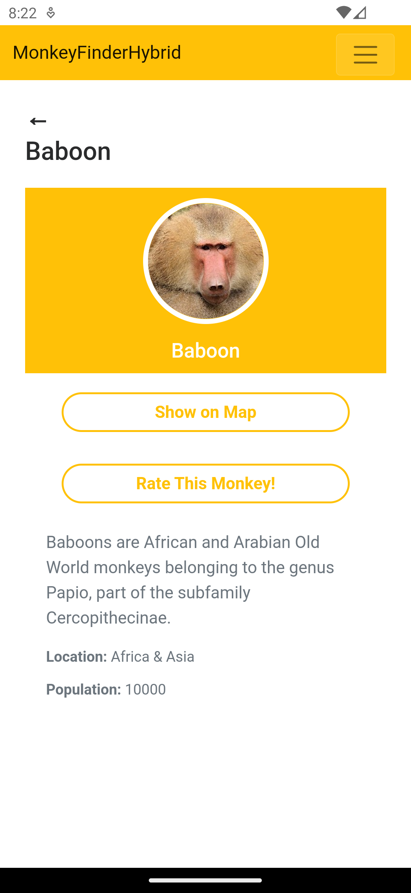
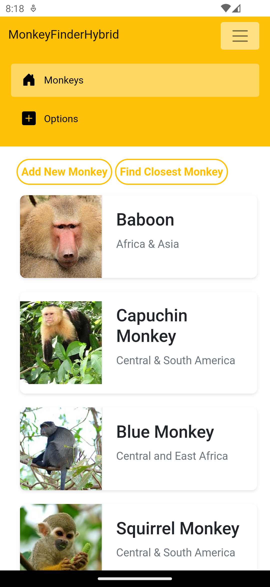
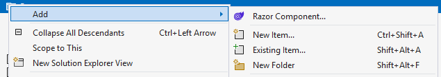
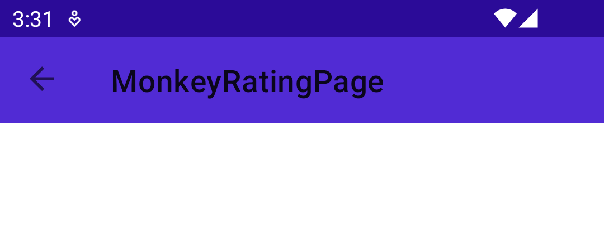

## Navigation

In Part 3 we will add simple navigation to our app. In a Blazor Hybrid app, you can navigate between pages in the app, just as you would in a regular Blazor app. But you can also navigate to a .NET MAUI page, which enables all kinds of mix-and-match scenarios, giving you access to all the power of both technologies.

Let's have a look at the different ways to navigate. 

## Navigation via Routes

We will use the URI based navigation provided by Blazor to navigate between pages within the app. You can pass additional information while navigating query parameter such as a string.

For example, let's say we wanted to navigate to a details page and pass in an identifier. In **Home.razor**, we would add:

```csharp
// In the top of our page
@inject NavigationManager NavManager

// To actually navigate
NavManager.NavigateTo($"details/mymonkey");
```

In the code above you can see how we first inject the `NavigationManager` object into the `NavManager` reference. The `NavigationManager` is a built-in object in Blazor (and also Blazor Hybrid), which enables you to navigate between pages.

On the `NavManager` we can then call several methods, one of which is the `NavigateTo()`. With `NavigateTo()` we can specify a URI as a parameter, and if that URI is available, our application will navigate to that page.

Then in our **DetailsPage.razor** page, we could add this:

```csharp
@page "/details/{name}"

<p> Value passed : @Name </p>

@code {

    [Parameter]
    public string Name { get; set; }

}
```

By adding `/{name}` to our `@page` Razor directive, we let the router component know that we expect a variable here.

Then in our `@code` block, we add a public property and add the `Parameter` attribute to it. If you remember from Part 2, the `Parameter` attribute allows us to set the value of this property from the outside. By doing so, this will make this page (or rather: component, everything is a component in Blazor) more reusable. This is also needed when you want to work with variables in your URIs.

Lastly, we bind that property to our user-interface in the `<p>` tag by adding the `@` sign in front of the property name. Now, when we navigate to this page, the name "mymonkey" will show up. Because remember, we specified this in the `NavManager.NavigateTo($"details/mymonkey");` in **Home.razor**. 

This type of navigation should be enough in most scenarios, but there are many more options and possibilities available. Also depending on the Blazor hosting model that you are using. For all options and features, please have a look at the [official documentation](https://learn.microsoft.com/aspnet/core/blazor/hybrid/routing?pivots=maui).

Now, let's add a click handler to the list items and pass the monkey to the details page and navigate to that.

### Add Selected Event

Let's start by adding navigation to a second page that will display monkey details!

1. In **Home.razor** we can add an `onclick` event to the `<li>` list item of our monkey list component:

    ```html
    <ul class="card-list">
        @foreach (var monkey in monkeys)
        {
            <!-- Notice the new @onclick attribute here -->
            <li @onclick="()=>GoToDetails(monkey)" class="card-item" >
                
                <div class="card-content">
                    <h2>@monkey.Name</h2>
                    <p>@monkey.Location</p>
                </div>
            </li>
        }
    </ul>
    ```

   This binds the `onclick` event to a method called `GoToDetails()` which we will define in the `@code` section. Also note how we put the `monkey` variable in there. So we provide the `GoToDetails()` method with a monkey that it should display.

1. We will inject the built-in `NavigationManager` service which allows us to do the route based navigation. In the top of the **Home.razor** file, add:

    ```csharp
    @inject NavigationManager NavManager
    ```

    This gives us access to the `NavigationManager` instance and we can invoke our navigation calls on that.

1. In the `@code` section, add this method:

    ```csharp
    private void GoToDetails(Monkey monkey)
    {
        NavManager.NavigateTo($"details/{monkey.Name}");
    }
    ```

That is all we need to do to wire up the navigation! Now let's see how we can actually make the navigation work and make it show the details.

### Update `MonkeyService` to Find Monkey Details

At this point we only have methods to retrieve all monkeys or add one monkey. We don't have any code that allows us to retrieve one specific monkey. When you want to look at the details for a specific monkey, that would be very useful, so let's implement it!

1. Open the **Services/MonkeyService.cs** file. We are going to add a method that can find the right `Monkey` object based on its `Name` property and return that `Monkey` object. This is the `Monkey` object we use to populate our **DetailsPage.razor** view:

    ```csharp
    public Monkey FindMonkeyByName(string name)
    {
        var monkey = monkeyList.FirstOrDefault(m => m.Name == name);

        if (monkey is null)
        {
            throw new Exception("Monkey not found");
        }
        
        return monkey;
    }
    ```

### Create `DetailsPage` User-Interface

Let's implement the user-interface for the `DetailsPage`. Our end goal is to get a fancy profile screen like this:

<p align="center">
    <picture>
        <source media="(prefers-color-scheme: dark)" srcset="../Art/Details-dark.png">
        <source media="(prefers-color-scheme: light)" srcset="../Art/Details-light.png">
        
    </picture>
</p>

1. Let's start with updating the route to reach this page, to include the `name` parameter. We will also inject the `NavigationManager` to be used in the next step. At the top of **DetailsPage.razor**, let's add:

    ```csharp
    @page "/details/{name}"
    @inject NavigationManager NavManager
    ```

1. To start implementing the design, let's add the top title and a back button. Without the back button you might get stuck on this page on some platforms.

   Android will have the dedicated back button, but iOS for example does not. One of the things to keep in mind when doing cross-platform development.

   Use the HTML below to replace the current placeholder in the **DetailsPage.razor** file.

    ```html
    <div>
        <div class="detailscard-header">
            <button class="detailsback-button" @onclick="CloseWindow">&#8592;</button> 
            <h1 class="detailstitle">@monkey.Name</h1>
        </div>
    </div>
    ```

1. We will also create a method called `CloseWindow()` to go back to the home page. Still in the **DetailsPage.razor** let's add:

   ```csharp
    @code {

        private void CloseWindow()
        {
            NavManager.NavigateTo("/");
        }
    }
    ```

1. Now, let's add the `Name` and `Image` section, followed by the monkey details section under it. Expand the outer `<div>` with this code:

    ```html
    <div>
        <div class="detailscard-header">
            <button class="detailsback-button" @onclick="CloseWindow">&#8592;</button>
            <h1 class="detailstitle">@monkey.Name</h1>
        </div>

        <!-- The below code was added in this step -->
        <div class="detailscard-image">
            
            <h2 class="detailsimage-title">@monkey.Name</h2>
        </div>
        <div class="detailscard-body">
            <button class="detailsbutton-yellow">Show on Map</button>
            <button class="detailsbutton-yellow">Rate This Monkey!</button>
            <p class="detailsdescription">@monkey.Details</p>
            <p class="detailslocation"><strong>Location:</strong> @monkey.Location</p>
            <p class="detailspopulation"><strong>Population:</strong> @monkey.Population</p>
        </div>
    </div>
    ```

   This creates bindings to the properties of the `Monkey` object. We also already added two buttons which we will use in a later part of this workshop. 

1. Next, let's update the code to retrieve the correct monkey using the route parameter and update the values in the user-interface.

   In the `@code` section, let's update our code to this:

    ```csharp
    @code {
        [Parameter]
        public string Name { get; set; }
        private Monkey monkey { get; set; } = new();

        protected override void OnInitialized()
        {
            monkey = monkeyService.FindMonkeyByName(Name);
        }

        private void CloseWindow()
        {
            NavManager.NavigateTo("/");
        }
    }
    ```

   The `[Parameter]` tag passes the monkey name to this page via the router. We then use the `FindMonkeyByName()` method we added to the `MonkeyService` earlier, to retrieve the correct `Monkey` object in the `OnInitialized` method of this page.

   Because of the data-binding we have set up in our user-interface, the values will automatically be populated.

1. Run the application on the a platform or your choice and tap on a monkey in the list to navigate to its details! Well done!

## Navigation Without Code

Everything we did above assumes that you want to use code for navigation, but what if you want to have some kind of navigation bar with links to different pages? Why would you need code for that?

Let's see how we can use the built-in `NavLink` component to navigate to pages by just using markup. Have look at the screenshot below to see our navigation bar to be in action:

<p align="center">
    <picture>
        <source media="(prefers-color-scheme: dark)" srcset="../Art/NavigationBar-dark.png">
        <source media="(prefers-color-scheme: light)" srcset="../Art/NavigationBar-light.png">
        
    </picture>
</p>

Because Bootstrap is part of the default Blazor (Hybrid) template, the navigation menu will be responsive. For smaller viewports the menu will be folded into the flyout menu (or hamburger menu), but when there is enough screen real estate, the menu will show on the screen.

Try rotating your device to landscape or running the application on desktop to see the navigation menu as a dedicated part of the screen.

Let's see how to implement all of this.

1. We'll start by adding a new page that we will navigate to. In the code for this part we already added the **Components/Pages/OptionsPage.razor**. If you continue building from your initial project, you can add a new page by right-clicking on the **Pages** folder, and choose **Add** -> **Razor Component...** and name the page **OptionsPage.razor**.

<p align="center">
    <picture>
        <source media="(prefers-color-scheme: dark)" srcset="../Art/AddNewPage-dark.png">
        <source media="(prefers-color-scheme: light)" srcset="../Art/AddNewPage-light.png">
        
    </picture>
</p>

1. Register the route to **OptionsPage.razor**, by adding the following line to the top of the page:

    ```csharp
    @page "/options"
    ```

1. Inside the **Layout** folder, open the **MainLayout.razor** file, and uncomment the following code:

    ```html
    <div class="sidebar">
        <NavMenu />
    </div>
    ```

    This code is part of the default Blazor Hybrid template but we commented it out for this workshop. This will make the navigation menu show up in our application.

    The `NavMenu` tag refers to the **NavMenu.razor** which holds the actual markup content for the navigation menu.

    You have probably noticed that the filename (**NavMenu.razor** and the actual markup tag `<NavMenu />`) share the same name. Components in Blazor can be used in other files by simply using the filename without the **.razor** extension as the markup tag.

    Because this markup is in the **MainLayout.razor** and the `MainLayout` is the layout that wraps each page by default, by adding this, the navigation menu will show up on all of our pages.

1. Inside the **Layout** folder, open **NavMenu.razor** and add the following code to create two navigation options in our menu for the Home and Options page:

    ```html
    <div class="nav-item px-3">
        <NavLink class="nav-link" href="" Match="NavLinkMatch.All">
            <span class="bi bi-house-door-fill-nav-menu" aria-hidden="true"></span> Monkeys
        </NavLink>
    </div>
    <div class="nav-item px-3">
        <NavLink class="nav-link" href="options">
            <span class="bi bi-plus-square-fill-nav-menu" aria-hidden="true"></span> Options
        </NavLink>
    </div>
    ```

    The important parts are the `NavLink` tags which are the Blazor built-in components for creating links that will use URI navigation.

    Under the hood this will still use the navigation that we have seen and implemented ourselves through the `NavigationManager` in the previous section. But this markup tag makes our lives a lot easier.
    
    We can now just declare a `NavLink` with the `href` attribute which points to the route we want to navigate to. We can apply some additional CSS styling through the `class` attribute.

    Inside of the `NavLink` tag you can put any valid HTML markup that will act as the actual link in our user-interface.

That's it, that's all! Run the project once again and you will see the navigation bar with the two pages. Click each option to navigate between them.

## Navigation to a .NET MAUI (non Blazor Hybrid) Page

In a Blazor Hybrid app, you have another navigation flow at your disposal to navigate to a `Page` written in .NET MAUI.

This is useful for cases when you maybe need to access platform-specific features or controls, or you want to reuse an existing page or control already written in .NET MAUI. 

There are two ways we can navigate to the .NET MAUI `Page`, via modal navigation or regular page navigation. Let's look at both of them now. 

### Create a .NET MAUI Page

Before we look at navigation, let's make a simple page in .NET MAUI using XAML. While we're using XAML here, pages composed in C# code will work just as well.

In the **MauiPages** folder, you will find a **MonkeyRatingPage.xaml** and **MonkeyRatingPage.xaml.cs** file already. If you need to add it manually, from Visual Studio, right-click on the **MauiPages** folder, and choose **Add** -> **New Item...**. In the new dialog find a .NET MAUI ContentPage (XAML) and name it **MonkeyRatingPage.xaml** then click Add.

Let's add a rating component to this page so we can rate each monkey!

1. If you're using the start-point project for this step the NuGet library is already installed, butif you're following along with your own project, make sure to install the [AlohaKit](https://github.com/jsuarezruiz/AlohaKit.Controls) library.

1. To use the `Rating` control from the AlohaKit library, we first need to add the right XML namespace in the `ContentPage` node. Make sure to add the `xmlns:alohakit` attribute as shown below.

    The order doesn't matter. We added it right after the other `xmlns` attributes

    ```xml
    <ContentPage
        xmlns="http://schemas.microsoft.com/dotnet/2021/maui" 
        xmlns:x="http://schemas.microsoft.com/winfx/2009/xaml" 
        xmlns:alohakit="clr-namespace:AlohaKit.Controls;assembly=AlohaKit">
        
    </ContentPage>
    ```

    The `xmlns` attributes are basically the equivalent of the `using` statements you already know. The name behind the colon is the identifier you will use in the rest of the XAML to prevent that you have to type the whole namespace that is the value of this attribute.

    That means in our case we can now use all the types in the `AlohaKit.Controls` namespace by just using `alohakit`. If we would have specified `xmlns:controls` then use `controls`. 

    We will see how to use this in the next step.

1. Open the **MonkeyRatingPage.xaml** file and add the following code which replaces everything between the `<ContentPage>` and `</ContentPage>` tags:

    ```xml
    <VerticalStackLayout
        VerticalOptions="Center"
        Spacing="15" Padding="10">

        <Label Text="How would you rate this monkey?"
               VerticalOptions="Center"
               HorizontalOptions="Center"
               HorizontalTextAlignment="Center"
               FontSize="20"/>

        <alohakit:Rating x:Name="rating"/>
    </VerticalStackLayout>
    ```

If you're not familiar with XAML, let's dissect what we have just added. The above code adds a `VerticalStackLayout`, this layout simply stacks the child components vertically. We influence the layout by centering it vertically, setting a spacing between the child items and adding a padding for the whole layout so that it doesn't touch the edges of our screen and looks a bit nicer.

Inside of the `VerticalStackLayout` we add a label and the rating control for which we installed the library. 

This immediately illustrates one of the use cases for navigating from Blazor Hybrid to .NET MAUI. Maybe you have a .NET MAUI control you need to use, but you can't reference a .NET MAUI component from Razor.

By being able to navigate between the two technologies, like we're doing now, you can combine all the good parts from both of those technologies to achieve what you need.

This adds a rating component with 5 stars to our .NET MAUI page. Now let's see the two ways to navigate to this page from Blazor Hybrid to .NET MAUI.

### Modal Navigation

With modal navigation, the page is pushed onto the navigation stack as a "floating" modal, that means, the pushed page (by default) does not have a navigation bar and no back button.

Additionally, modal means that it will be pushed on top of everything else. This can be useful in some scenarios, especially when combining Blazor Hybrid with .NET MAUI to have a clear separation between the two. But it might not always be what you want. We will get to that in a minute.

When using modal navigation, it is important to have a back/close button to handle that logic in your page and make sure your users don't get stuck.

1. Let's add a close button to the **MonkeyRatingPage.xaml** page, by adding this code under the AlohaKit `Rating` control and above the closing `</VerticalStackLayout>` tag:

    ```xml
    <VerticalStackLayout>
        <alohakit:Rating x:Name="rating"/>

        <!-- This was added -->
        <Button Text="Close Page" Clicked="Button_Clicked" />
    </VerticalStackLayout>
    ```

2. Next, we're going to add the click event to this button, by adding the below code to **MonkeyRatingPage.xaml.cs**, the XAML page code-behind:

    ```csharp
    public void Button_Clicked(object sender, EventArgs e)
    {
        Debug.WriteLine("Monkey Rating: " + rating.Value);
        Navigation.PopModalAsync();
    }
    ```

    Again, maybe you're not familiar with .NET MAUI and/or XAML, a code-behind file is essentially the same as the `@code` block in your Razor files, but in a seperate file. Actually this is also possible with Razor pages, but most people choose to use the `@code` blocks.

    In Visual Studio the **.xaml** and **.xaml.cs** files are grouped together, so if you don't immediately see the file in the Solution Explorer, make sure to expand the **.xaml** file node.

    The code we added here will print the selected rating to the debug console and then it will pop this page from the modal stack and we will end up with the previous (Blazor Hybrid) page.

We're now ready to add the navigation logic in our Razor page. In the **DetailsPage.razor** page, let's add a button that opens the monkey ratings page, which is a .NET MAUI XAML page, that we just created. 

1. Open the **Components/_Imports.razor** file and add the below line to it:

    ```csharp
    @inject IApplication app
    ```

    We've seen the **_Imports.razor** file a couple of times already. It allows us to import namespaces once and not repeat them for each page where we want to use them. However, that is not the only thing you can do here. You can also use the `@inject` directive to inject objects from our dependency injection container. Because we will be using this `IApplication` object in multiple pages, we're adding it here.

    The `IApplication` interface is a .NET MAUI type and represents the current application. On this we can call methods to show dialogs and navigate to other pages. This type is automatically registered for us by the .NET MAUI framework and thus can be injected without registering it ourselves.

1. Open **Components/Pages/DetailsPage.razor**, and add a click event to the button that we added a little earlier to this page for Rate This Monkey! 

    ```html
    <button class="detailsbutton-yellow" @onclick="AddRating">Rate This Monkey!</button>
    ```

2. In the `@code` section on this same page, setup the click event to perform the modal navigation, by using this code:

    ```csharp
    private void AddRating()
    {
        ((Application)app).Windows[0].Page!.Navigation.PushModalAsync(new MonkeyRatingPage());
    }
    ```

    This line looks a bit interesting. We take the injected `IApplication` from the first step and cast that to the concrete `Application` object which is also a .NET MAUI type. This allows us to access the `Windows` and `Page` properties respectively. We'll learn more about that in a minute.

If you run the app now, and you click on Rate This Monkey! on the monkey detail page, it will show our new .NET MAUI page as a modal!

Notice how the styling seems a little off, especially the button. This is because the .NET MAUI page doesn't look at the CSS files for styling. This styling is done from XAML. In case of this button this styling is defined in the **App.xaml** file.

You have multiple options for styling there, but since this workshop is about Blazor Hybrid, the .NET MAUI styling is out of scope. If you want to learn more about styling in XAML, have a look at [the documentation](https://learn.microsoft.com/dotnet/maui/user-interface/styles/xaml).

In your own, real-world, app you will want to make sure that the styles match so the user doesn't see the difference between going from Razor to .NET MAUI and vice versa.

Back to the navigation! Modal navigation might not always be what you want, so let's also have a look at how you can do it the "regular" way.

### Page ("Regular") Navigation

Page navigation is what usually happens when you navigate between pages and when you do not explicitly specify that the page you're navigating to needs to be modal.

With page navigation, the page is pushed onto the (regular) navigation stack and usually there is a way provided to navigate back, either by the framework you use or the operating system.

The way the navigation looks and feels is dependent on what is being used. For .NET MAUI the easiest way is to use a `NavigationPage`. The first page where you want to start navigating from, needs to be wrapped in a `NavigationPage`, and by calling `PushAsync()` on a `NavigationPage`, the wrapper page will know how to push a new page on the stack and show it to the user.

For example on iOS and Android, this will automatically result in a back button being shown for the user to navigate back. Or, on Android the user can use the hardware back button.

Because we are combining two frameworks here: Blazor and .NET MAUI, we need to take a couple of things into account for a great user experience. Let's go over them step by step below:

1. In **App.xaml.cs**, you will see that we override the `CreateWindow()` method. This method is called by .NET MAUI when we request the application to create a window. This is also where we assign the root page for this window and in this case; our application. In our case we assign the `MainPage`, which is a .NET MAUI page.

    This page houses the `BlazorWebView` and that provides us with the ability to build Blazor Hybrid apps. To enable the native navigation to also be able to navigate to .NET MAUI pages, we need to wrap our `MainPage` in a (.NET MAUI) `NavigationPage`.

    Adapt the `CreateWindow()` code in the **App.xaml.cs** to look like this:

    ```csharp
    protected override Window CreateWindow(IActivationState? activationState)
    {
        // Before
        // return new Window(new MainPage());
        // After
        return new Window(new NavigationPage(new MainPage()));
    }
    ```

    For this app we're using a single-window app and the code makes some assumptions based on this like when we show a dialog or when we do navigation. In fact, this is probably true for a majority of the mobile apps. However, .NET MAUI also supports [multi-window](https://learn.microsoft.com/dotnet/maui/fundamentals/windows#multi-window-support).

    A little earlier we talked about the `IApplication` and already used that to navigate. There was a reference in there to `Windows[0]`. That is one of those places where we assume a single-window application. At the time of creating this workshop a better way of doing this is in the works but not yet completely implemented. This might change in the future.

    As mentioned, by wrapping the `MainPage` in a `NavigationPage` we now gain the functionality to easily navigate beween .NET MAUI pages. Notice how we specifically mention .NET MAUI pages.
    
    If you would run the app now, you will notice that there is a (purple) navigation bar on top of the (yellow) navigation bar that was already there from Blazor. This is of course not what we want. Luckily, we can influence this behavior on a per-page basis.

1. In the **MainPage.xaml**, add a attribute on the `ContentPage` node as seen below:

    ```xml
    <ContentPage
        NavigationPage.HasNavigationBar="False">
    ```

    There will be other attributes already there, add the one shown above to it. This will remove the top (the .NET MAUI `NavigationPage`) navigation bar so that our Blazor Hybrid app looks as it did before. Note that this does mean that every other page will still get the navigation bar. This is probably what you want for .NET MAUI pages, because this will also automatically give us the functionality to navigate back, you will see that in a second. 
    
    But for other pages you might not want this. Add the above attribute to each page, or make a specialized page to not repeat this over and over again and inherit from that.

1. In the **DetailsPage.razor**, update the `AddRating()` method to match the code below:

    ```csharp
    private void AddRating()
    {
        ((Application)app).Windows[0].Page!.Navigation.PushAsync(new MonkeyRatingPage());
    }
    ```

    Note that the `PushModalAsync()` call was changed to just `PushAsync()`. This will not push the `MonkeyRatingPage` as a modal, but as a regular page. And because we now wrapped the our root page (`MainPage`) in a `NavigationPage` (we did that in the **App.xaml.cs** earlier), it will automatically know how to push the page on the navigation stack and that will give us the back button so that the user can find their way back.

Run the app, notice that the app looks like as it did before. Now, navigate to a monkey and tap the Rate This Monkey! button. You will see that this (.NET MAUI) page has a navigation bar too and that provides us with a back button to go back.

<p align="center">
    <picture>
        <source media="(prefers-color-scheme: dark)" srcset="../Art/HasNavBar-dark.png">
        <source media="(prefers-color-scheme: light)" srcset="../Art/HasNavBar-light.png">
        
    </picture>
</p>

Again, here the styling is off as this comes from the .NET MAUI side. Go back to the **App.xaml.cs** file and update the `NavigationPage` like this:

```csharp
protected override Window CreateWindow(IActivationState? activationState)
{
    return new Window(new NavigationPage(new MainPage())
    {
        BarBackgroundColor = Color.FromArgb("#ffc107"),
        BarTextColor = Colors.White
    });
}
```

This will make the navigation bar color the same as the Blazor Hybrid theming.

You can now delete the close button on the .NET MAUI page. If you do want to keep a close button on your page, make sure to go into the code-behind and change the `PopModalAsync()` call from earlier to `PopAsync()`. The modal and non-modal navigation stacks are two separate things.

You cannot push it on the regular stack and then pop it on the modal stack. Trying to do so will have no result other than you wondering what is going wrong as it is not working as expected.

For the sample code of this workshop we will stick with the regular navigation and remove the code for the modal navigation.

1. If you haven't done so already, remove the `Button` tag from the **MonkeyRatingPage.xaml**:

    ```xml
    <VerticalStackLayout>
        <!-- Label code is above here, but omitted here for brevity -->
        <alohakit:Rating x:Name="rating"/>

        <!-- This was removed -->
        <Button Text="Close Page" Clicked="Button_Clicked" />
    </VerticalStackLayout>
    ```

1. Then in the **MonkeyRatingPage.xaml.cs** code-behind file remove this event handler that was associated with the button:

    ```csharp
    public void Button_Clicked(object sender, EventArgs e)
    {
        Debug.WriteLine("Monkey Rating: " + rating.Value);
        Navigation.PopModalAsync();
    }
    ```

As you might have noticed, we didn't actually implement the rating functionality. For your own, real-world app, you would implement whatever your actual business logic is. This might be to save the rating to the monkey, but maybe also to do a call to a remote service to persist the results online.

We won't go into implementing saving the actual rating value in this part, we have learned what we wanted to learn here which is combining Blazor Hybrid and .NET MAUI pages.

In Part 6 we will look at more advanced concepts. One of which is about sharing state between Blazor Hybrid and .NET MAUI. There we will learn about how to establish an even deeper integration between the two technologies.

During the course of this part we have mentioned a couple of times that the styling suddenly looks a bit different depending on the page. This is because the one page is a Razor page and is styled with HTML and CSS, and the other page is a .NET MAUI page which is styled with XAML. For this workshop code we simply made sure that all the colors are set to the same values, for your real-world app you probably want to define those colors once or implement implicit styling. This will make your code easier to maintain.

For now, platform features is the next topic for us to explore. Whenever you're ready, navigate to [Part 4](../Part%204%20-%20Platform%20Features/README.md) to begin the next module.