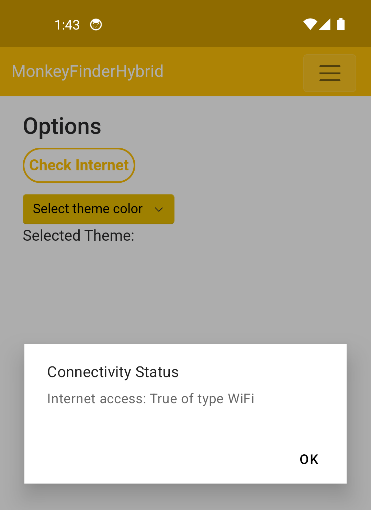
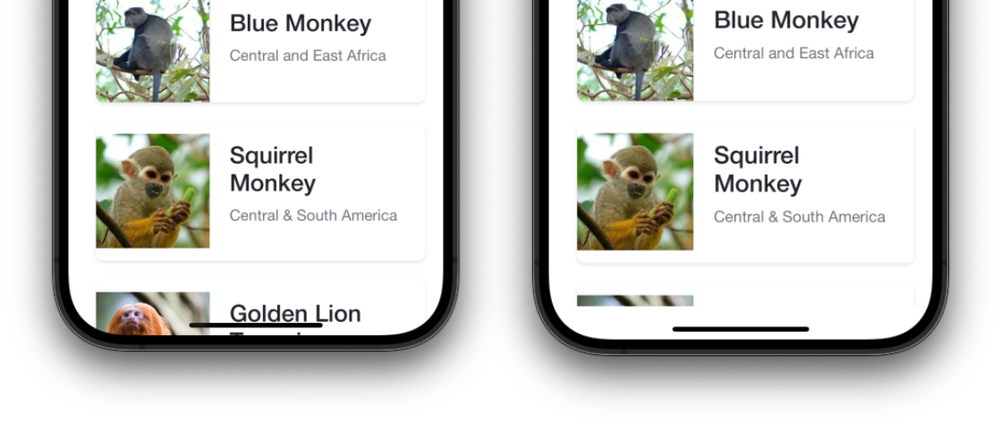

## Accessing Platform Features

Another big advantage of Blazor Hybrid built on top of .NET MAUI is that you can leverage the full power of the device and operating system, while still using a unified .NET API to tap into it. Until now we have mostly seen how to build our app leaning towards the Blazor part of Blazor Hybrid, but in this part we will start using APIs provided by .NET MAUI to enrich our user experience even further.

That means a deep integration with the apps on a platform: just one line of code and you can open the default maps app showing a location of your choosing. Or how about accessing the device location, flashlight, contacts, pick an image or check if the device is connected to the internet and much, much more. This is all available through easy to use .NET APIs that work cross-platform on Android, iOS, Windows and macOS _and_ can also be used through Blazor Hybrid.

When running Blazor from the browser as a web app, a lot of this is not possible or only in limited form because of the browser sandbox. However, remember that Blazor is "just" a .NET app which can run directly on the .NET runtime. The .NET runtime available on iOS, Android, macOS and Windows through .NET MAUI, so if we put those two together, we leverage the strength of both of these platforms and do things that go beyond browser capabilities.

However, we're still bound to the sandbox imposed by the operating system. For example, if we want to use certain functionalities, we still have to declare the permissions in the app metadata and request them at runtime where applicable. This is the same for a .NET MAUI app, as well as a Blazor Hybrid app which is essentially still a .NET MAUI app at its core.

In this part, Part 4, we will leverage .NET MAUI APIs to check for network connectivity in our app, and we implement functionality to find the closest monkey to our location using geolocation. And lastly, we'll have a look at opening the device's default Maps app and make it show the location of a certain monkey.

With that, lets have a look at how we can check for network connectivity.

### Check for Internet Connection

We can easily check to see if the users' device is connected to the internet with the built-in [`Connectivity` APIs](https://learn.microsoft.com/dotnet/maui/platform-integration/communication/networking) of .NET MAUI.

1. First, let's setup a button to check connectivity in the **Components/Pages/OptionsPage.razor** page. Add a button with a click event:

    ```html
    <button class="button-yellow" @onclick="CheckInternet">Check Internet</button>
    ```

    This is similar to what we have seen in Part 2, with adding the Add Monkey dialog, where we learned about handling events in Razor.

1. With that in place, let's check for an active internet inside of the `CheckInternet` method and display an alert with the network status information.

    ```csharp
    public async Task CheckInternet()
    {
        var hasInternet = Connectivity.Current.NetworkAccess == NetworkAccess.Internet;
        var internetType = Connectivity.Current.ConnectionProfiles.FirstOrDefault();
        
        await ((Application)app).Windows[0].Page!.DisplayAlert("Connectivity Status",
            $"Internet access: {hasInternet} of type {internetType}", "OK");
    }
    ```

    Notice how we can just call on `Connectivity.Current` to get information about our network. This is a static reference that we can use everywhere. If you prefer to use it through dependency injection, this is also possible, we'll explore that in the next section.

    Lastly notice how we show an alert by calling `(Application)app).Windows[0].Page!.DisplayAlert()`. This is a .NET MAUI API and will show a native alert dialog as you would expect it to look like on the operating system that you are running on. We're again using the `IApplication` object that is injected throught .NET MAUI which we learned about in Part 3.
    
    Again, a great example of how we can mix native and web (or Blazor) functionality seamlessly.

1. For Android we need to also declare permissions to be able to access network information. There are multiple ways to do this, for now we will only show you one of those. From the Visual Studio Solution Explorer, in your **MonkeyFinderHybrid** project find the **Platforms/Android/AndroidManifest.xml** file. Right-click and choose Open With... Then choose XML (Text) Editor.

   If you're using Visual Studio Code, find this same file, but just open it as it will open with the text editor by default.

   This is the metadata file for your Android app. Find the `manifest` node and add this line inside of it, above or under the already declared `uses-permission` nodes: 
   
   ```xml
   <uses-permission android:name="android.permission.ACCESS_NETWORK_STATE" />
   ```

    For the other platforms no permissions are needed for acessing the network information.

Run the app on your emulator or physical device, navigate to the options page and click the button we've just added. You can toggle on and off airplane mode, or switch from WiFi to ethernet and vice versa to check your implementation and see the differences.

<p align="center">
    <picture>
        <source media="(prefers-color-scheme: dark)" srcset="../Art/ConnectivityStatus-dark.png">
        <source media="(prefers-color-scheme: light)" srcset="../Art/ConnectivityStatus-light.png">
        
    </picture>
</p>

> [!TIP]
> Preferably you would use dependency injection for these APIs. For the same of this example we will leave the `Connectivity` API as-is here. By the end of this part you should be able to refactor this yourself to use dependency injection.

### Find Closest Monkey

As part of the data we have on the monkeys, we also have a latitude and longitude available to us. This enables us to add event more functionality to this app using the geolocation functionality of the device.

Each of the supported platforms will have ways of determining the devices' location. This can be through the cellular connection, GPS sensor or other means that are available.

Luckily, you don't have to worry about any of this, you can just use the [`Geolocation` APIs](https://learn.microsoft.com/dotnet/maui/platform-integration/device/geolocation) built into .NET MAUI to make it work on all platforms from a single codebase.

We're going to add this functionality in the **Home.razor** page. And this time we will not use the static class, but we'll use dependency injection.

Here we will be showing it with geolocation, but all the similar device and sensor APIs will have corresponding interfaces and everything you need to leverage dependency injection to use them.

1. Register the `IGeolocator` interface in our **MauiProgram.cs**. We have already added a couple of lines here for other dependency injection registrations, so just add the below line in there as well. As long as you make sure that this line is somewhere before the `return builder.Build();` line, everything should be good.

    ```csharp
    builder.Services.AddSingleton<IGeolocation>(sp => Geolocation.Default);
    ```

    This will register the static `Geolocation.Default` implementation in our dependency injection container. We register it under the `IGeolocation` interface so that we can easily swap out implementations if we want to, for example for testing purposes. You don't have to use interfaces, you can register the concrete implementation if you want to as well.

    We're using an overload of `AddSingleton()` that takes a `Func`. If you don't know what that is: that is basically a method that will be executed later. In our case, this means we register this `IGeolocation` implementation but as a method. Only whenever a `IGeolocation` instance is requested, the method will be executed and the instance is returned. By doing it like this, we will gain a performance boost by not loading all instances in memory from the start of the application, but instead only when needed. This concept is also known as lazy loading.

    As mentioned before: if you have used ASP.NET or Blazor on the web before, this should look very familiar as this works the exact same way there.

1. With our registration for the dependency container in place, we're now ready to inject the `IGeolocator` into our **Home.razor**. At the top of this file, add this line:

    ```html
    @inject IGeolocation geolocation
    ```

1. Under the button to add a new monkey, let's add a button to find the closest monkey and wire up a click event for `FindMonkey`:

    ```html
    <!-- This one is already here -->
    <button class="button-yellow" @onclick="AddMonkey">Add New Monkey</button>
    <!-- We're adding the one below -->
    <button class="button-yellow" @onclick="FindMonkey">Find Closest Monkey</button>
    ```

1. We can now create the `FindMonkey` method to use the .NET MAUI `Geolocation` API to query for our location and with that determine which monkey in our data is the closest to us:

    ```csharp
    private async Task FindMonkey()
    {
        try
        {
            // Get cached location, else get real location.
            var location = await geolocation.GetLastKnownLocationAsync();
            if (location is null)
            {
                location = await geolocation.GetLocationAsync(new GeolocationRequest
                {
                    DesiredAccuracy = GeolocationAccuracy.Medium,
                    Timeout = TimeSpan.FromSeconds(30)
                });
            }

            // Find closest monkey to us
            var closestMonkey = monkeys.OrderBy(m => location.CalculateDistance(
                new Location(m.Latitude, m.Longitude), DistanceUnits.Miles))
                .FirstOrDefault();

            var closestMonkeyMessage = string.Empty;

            if (closestMonkey is not null)
            {
                closestMonkeyMessage = $"{closestMonkey.Name} is closest, this monkey is in {closestMonkey.Location}";
            }
            else
            {
                closestMonkeyMessage = "The closest monkey could not be determined!";
            }

            await ((Application)app).Windows[0].Page!.DisplayAlert("Closest Monkey",
                closestMonkeyMessage, "OK");

        }
        catch (Exception ex)
        {
            Debug.WriteLine($"Unable to query location: {ex.Message}");
            await ((Application)app).Windows[0].Page!.DisplayAlert("Error!", ex.Message, "OK");
        }
    }
    ```

    In the implementation above you will see how we first check if we have a geolocation already cached. Depending on the platform you're running on, it's not uncommon that multiple apps, including the operating system itself, will query the device location. That's why a cached location might be already there even if you didn't request is before yourself.

    If no cached location is found, we're going to put in a request with the operating system to actually query our location at this time. There are some options you can tinker with depending on your use-case.

    When you're building a turn-by-turn navigation app then the accuracy should be as high as possible, however that means that a lock on your exact position might take longer. For just quering approximately how close we are to a monkey, we don't need the highest accuracy. Lowering the accuracy means we will get a fix on our position sooner.

    The timeout is there to assure that we don't let the user wait for too long and we can inform them something went wrong. It will throw an exception when the timeout is hit, hence the `try/catch` block.

    If the location is determined, we query our monkey data and use another built-in .NET MAUI API to calculate the distance and return us the closest monkey to the determined location. Lastly, we present the result in a dialog.

To see all of this in action for yourself, build the app, run it on your favorite platform and see how it works!

Note, if you're using an emulator the location might not represent your actual location. On the other hand, you might be able to configure the location so you can play around with that and see the differences in results.

#### Location Permissions

This project is pre-configured with all required permissions and features needed for `Geolocation` on each platform. Please refer to the the [documentation](https://learn.microsoft.com/dotnet/maui/platform-integration/device/geolocation#get-started) to find out more about the actual setup. To give you some idea, here is a quick overview:

1. The Android manifest permissions are pre-configured in **Platforms/Android/AndroidManifest.xml**;
1. iOS and macOS have separate manifest files, but the structure is identical. The permissions are configured in the **Platforms/iOS/Info.plist** file for each platform, for macOS replace **iOS** with **MacCatalyst** in the file path.
1. The Windows manifest permissions are configured in the **Platforms/Windows/Package.appxmanifest**

These are also the files where will need to configure other permissions if needed, as well as other metadata about your app. At this time this is beyond the scope of this workshop.

For more information about permissions specifically, please find the documentation [here](https://learn.microsoft.com/dotnet/maui/platform-integration/appmodel/permissions).

We have successfully implemented network connectivity functionality, and are able to determine the closest monkey to our location. Lastly, we will implement showing a monkeys location on a map by leveraging the devices' default Maps application.

### Opening the Default Maps App

At the time of writing, .NET MAUI provides over 60 platform features from a single API. And opening the default map application is on of them!

If you're wondering what else is available, on [Microsoft Learn](https://learn.microsoft.com/dotnet/maui/platform-integration/) we have documentation for each of the APIs. 

In the **DetailsPage.razor** page, we're going to add a new button that will open the Maps app on our device and provide that with all the information needed to show a pin on the location of the monkey of our choosing.

1. Like above, where we added the geolocation functionality, we will use dependency injection for this API as well. Go to **MauiProgram.cs** and add another line to register the `IMap` interface with a concrete implementation again:


    ```csharp
    builder.Services.AddSingleton<IMap>(sp => Map.Default);
    ```

1. Different from above, lets still inject the `IMap` reference **DetailsPage.razor**, but now do it in our `@code` block like this:

    ```csharp
    [Inject]
    private IMap map { get; set; }
    ```

    This does exactly the same as doing `@inject IMap map` in the top of your Razor page and is just a different notation.

    If you remember from Part 3, I mentioned that you can also use Razor files with separate code-behind files. If that is what you prefer, this will enable you to inject dependencies this way.

    Or if you prefer to use `@code` blocks but not the `@inject` notation, that is also fine. The choice is yours!

1. Earlier, we already added the Show on Map button to our **DetailsPage.razor** page, now let's update it with the `@onclick` handler:

    ```html
    <button class="detailsbutton-yellow" @onclick="OpenMap">Show on Map</button>
    ```

1. In the `@code` section, create the corresponding `OpenMap` method that calls into the `Map` API passing in the monkey's location:

    ```csharp
    private async Task OpenMap()
    {
        // Open platform-specific map
        try
        {
            if (map is null)
            {
                throw new Exception("No map service available.");
            }

            await map.OpenAsync(monkey.Latitude, monkey.Longitude, new MapLaunchOptions
            {
                Name = monkey.Name,
                NavigationMode = NavigationMode.None
            });
        }
        catch (Exception ex)
        {
            Debug.WriteLine($"Unable to launch maps: {ex.Message}");
            await ((Application)app).Windows[0].Page!.DisplayAlert("Error, no Maps app!", ex.Message, "OK");
        }
    }
    ```

    First we check if we actually got a concrete implementation injection in our `map` reference. If not, we throw an exception.

    Then, we call on the `IMap` implementation to open the operating system Maps app and we specify a couple of options: the name of the monkey and the preferred navigation mode.
    
    Depending on the platform that you're running on some might show the name of the monkey in their user interface, others might not. Same for the navigation mode, this can be used to show a slightly different UI by the Maps app.

    For example, if you're building an app that shows hiking routes and you want to use this API to let the user open the route in their default Maps app, you can set it to use the walking navigation mode as it will be likely that the user is going to walk.

For Android a special entry is needed in the **Platforms/Android/AndroidManifest.xml** is needed. For this workshop we have set that up for you, but you might want to read up on the [documentation](https://learn.microsoft.com/dotnet/maui/platform-integration/appmodel/maps) on why that is exactly. For other platforms nothing else is needed.

Run the application, navigate to a monkey, and then press Show on Map button to launch the default Maps app on the specific platform that you're running on.

To learn more about the Map APIs, please refer to the [Microsoft Learn pages](https://learn.microsoft.com/dotnet/maui/platform-integration/appmodel/maps) for it.

#### Alternative Implementations

Of course this is just one implementation of how to do it. This example shows you how to work with the default apps on a device.

You could also choose to keep the users inside of your own app by showing a map directly on the page.

And because we're using Blazor Hybrid, you now have another option: use a web-based control in a Razor page or show a .NET MAUI page and show the built-in .NET MAUI [`Map` control](https://learn.microsoft.com/dotnet/maui/user-interface/controls/map).

## Platform-Specifics: iOS Safe Area Layouts

In addition to accessing cross-platform device APIs, .NET MAUI also includes platform-specific integrations. If you have been running the Monkey Finder Hybrid app on an iOS device with a notch or Dynamic Island, you may have noticed that the buttons on the bottom overlap the bar on the bottom of the device.

To provide for a safe margin, iOS has the concept of Safe Areas that you must programmatically turn on. By doing so, your app will not only look better, but also visual elements will not become unreachable for your users. 

For .NET MAUI apps this is built-in, for Blazor Hybrid apps we will need to enable this manually. Luckily, through the APIs provided by .NET MAUI, this is an easy task.

1. Open **MainPage.xaml** and add a new namespace for iOS specifics on the `ContentPage` node:

    ```xml
    <ContentPage
        xmlns:ios="clr-namespace:Microsoft.Maui.Controls.PlatformConfiguration.iOSSpecific;assembly=Microsoft.Maui.Controls">
    ```

1. Still on the `ContentPage` node, also add the following attribute underneath the one we just added above:

    ```xml
    <ContentPage
        xmlns:ios="clr-namespace:Microsoft.Maui.Controls.PlatformConfiguration.iOSSpecific;assembly=Microsoft.Maui.Controls"
        ios:Page.UseSafeArea="True">
    ```

If you have access to Mac or iOS hardware, re-run the application on the iOS Simulator or physical iOS device and notice the content has automatically been shifted up at the bottom. If you do not have a iOS device, don't worry about it. You can see the difference between not respecting the Safe Area (left) versus respecting the Safe Area (right) in the screenshot below.

<p align="center">
    <picture>
        <source media="(prefers-color-scheme: dark)" srcset="../Art/safe-area-ios-dark.png">
        <source media="(prefers-color-scheme: light)" srcset="../Art/safe-area-ios-light.png">
        
    </picture>
</p>

This example is just to show you that this is available and it works also for Blazor Hybrid as well as .NET MAUI. Right now we won't spend any time polishing this for our project. Also this code is not part of the workshop project code, but feel free to add it yourself. The safe area layout is just one of the platform-specifics in .NET MAUI, there are more available for different platforms.

The cool thing about these platform-specifics in .NET MAUI is that they only affect the platform they are intended for, but without any additional code it will not have effect on any other platform. No need for if-statements to filter out platforms. For the relevant platform it will take effect, for others, it will be ignored.

Let's move forward to the next module and learn more about theming our app in [Part 5](../Part%205%20-%20Theming%20the%20app/README.md)
