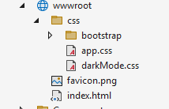

## App Themes

People won't even consider your app anymore if it doesn't support dark theme!

So to prevent 1-star reviews of your application, let's learn how we can implement support for light and dark theme for our Monkey Finder Hybrid app.

## Theme Changes - Light/Dark Theme

Styling a Blazor Hybrid app is done using Cascading Style Sheets (CSS) files. That means you can leverage all capabilities in HTML and CSS to implement light and dark theme. The user-interface in a Blazor Hybrid application is a web interface after all.

In Blazor (and therefore Blazor Hybrid), you have the option to use a single CSS file for styling the complete app or you can use [CSS isolation](https://learn.microsoft.com/aspnet/core/blazor/components/css-isolation). 

CSS isolation scopes the CSS to a Razor component. This can simplify your CSS styling and at the same time avoid collisions with other components or libraries.

In this workshop, we will be using a single, app-wide CSS file but you can see CSS isolation examples with the **MainLayout.razor** and **NavMenu.razor**. These files have a matching **MainLayout.razor.css** and **NavMenu.razor.css** file. It is that easy to enable CSS isolation.

Inside the **wwwroot** folder, there is a folder **css** which contains two files **app.css** and **darkMode.css**.

These files contain the styling for light and dark theme in our app.

<p align="center">
    <picture>
        <source media="(prefers-color-scheme: dark)" srcset="../Art/wwwCss-dark.png">
        <source media="(prefers-color-scheme: light)" srcset="../Art/wwwCss-light.png">
        
    </picture>
</p>

Let's have a look at how we can add an option in the app to change the colors based on a user configuration. 

1. Inside the **wwwroot** folder, in the **index.html** file, update the existing code within the `<head>` tag.

    ```html
    <!-- Before -->
    <link rel="stylesheet" href="css/app.css" />

    <!-- After -->
    <link id="dark-mode" rel="stylesheet" href="css/darkMode.css" disabled />
    <link id="light-mode" rel="stylesheet" href="css/app.css" />
    ```

    This adds a reference to both style sheet files and sets the light theme as the default app theme. Notice how we use the `disabled` attribute on the dark mode node to disable it initially.

1. Still in the **index.html** file, let's add a `<script>` tag to handle the changes within the `<body>` tag, in our code we placed this right before the closing `</body>` tag: 

    ```html
    <script>
        function setTheme(mode) {
            const darkModeLink = document.getElementById('dark-mode');
            const lightModeLink = document.getElementById('light-mode');

            if (mode === 'dark') {
                darkModeLink.disabled = false;
                lightModeLink.disabled = true;
            } else {
                darkModeLink.disabled = true;
                lightModeLink.disabled = false;
            }
        }
    </script>
    ```

    That's right, a bit of JavaScript! While you should be able to build Blazor (Hybrid) apps without the need of JavaScript, you still can leverage it when needed.

    Depending on the setting, this code will swap around that `disabled` attribute from one CSS reference to the other, effectively switching between light and dark theme.

1. The **OptionsPage.razor** seems like a logical place to configure which theme to use, so let's add a button to toggle between the two style files in here. 

    Let's add a button to change theme to dark mode, add it below the button that is already there to check for internet connectivity: 

    ```html
    <button class="button-yellow" @onclick="ChangeTheme">Change Theme</button>
    ```

1. Before we implement the code to switch to dark theme, we will need to inject the `IJSRuntime`. This is a built-in library in Blazor that allows for easy interaction with JavaScript. Also known as JavaScript interoperability or JavaScript interop for short.

    Add this to the top of the **OptionsPage.razor** file:

    ```html
    @inject IJSRuntime JS
    ```

    As mentioned, this is built into Blazor, no need to manually register this dependency anywhere.

1. In the `@code` block of the **OptionsPage.razor** page, we now implement the `ChangeTheme` method code to actually switch the theme to dark:

    ```csharp
    public async Task ChangeTheme()
    {
        await JS.InvokeVoidAsync("setTheme", "dark"); 
    }
    ```

    Through the `IJSRuntime` implementation that we acquired from the Blazor Hybrid runtime, we can now invoke JavaScript code.

    In our case, we call `setTheme` that we implemented above in **index.html**. The `InvokeVoidAsync()` method allows us to call a JavaScript method that does not return a value. 

    The first parameter specifies the method name to call, in our case `setTheme` and then you can add all the parameter values that you need to pass on to that method.
    
    In our case `setTheme` needs a string parameter to determine the theme to set. Therefore we add `dark` as the second parameter. If there were more parameter values we would need to provide, just add them here.

Run the app and click on the button we've just added in the Options page. You will notice how the theme will change from light to dark!

Let's make this option a little bit more interactive and see how we can use .NET MAUI APIs to get the system theme and use that to change the app theme automatically.

For more information about JavaScript interoperability, please refer to the [official documentation](https://learn.microsoft.com/aspnet/core/blazor/javascript-interoperability/).

## Follow the System Theme Setting

Letting the user change the style manually is great, but what is even better is if we adopt the operating system setting for this. 

All platforms now have support for light and dark mode, and we can query the currently configured option and use that to automatically let our app use the right theme as well.

The way will we implement this is as a third option next to selecting light or dark theme. We will add an option for System, which will follow the operatings system setting for this.

1. First, we're going to replace the button we added above with a picker. With that, the user can select the app theme to use.

    In the **OptionsPage.razor**, let's add another Fluent UI Blazor Component, this time the [MenuButton](https://fluentui-blazor.net/MenuButton).

    This dropdown menu will have three options: Light, Dark or System.

    Replace the Change Theme button we added above, with this:

    ```html
    <FluentMenuButton Text="Select theme color" OnMenuChanged="HandleOnMenuChanged">
        <FluentMenuItem Id="1">Light</FluentMenuItem>
        <FluentMenuItem Id="2">Dark</FluentMenuItem>
        <FluentMenuItem Id="0">System</FluentMenuItem>
    </FluentMenuButton>
    
    <p class="optionstheme">Selected Theme: @selectedTheme</p>
    ```

    If you haven't added the `@using Microsoft.FluentUI.AspNetCore.Components` statement either to your **_Imports.razor** or at the top of this **OptionsPage.razor**, do it now so that the Fluent UI Blazor Components are imported correctly.

    This will give us a dropdown menu with the 3 options and whenever the user changes the selected option the `HandleOnMenuChanged` method is invoked.

1. In the `@code` section, let's update the code to change the theme for each selected option. To get the currently configured operating system theme setting, we will use the .NET MAUI API [`Application.Current.RequestedTheme`](https://learn.microsoft.com/dotnet/maui/user-interface/system-theme-changes#detect-the-current-system-theme).

    ```csharp
    private string selectedTheme = string.Empty;

    public async Task HandleOnMenuChanged(MenuChangeEventArgs args)
    {
        selectedTheme = args.Id ?? "1";
        Debug.WriteLine($"Selected Value: {args.Id}");
        var selectedValue = args.Id;

        if (string.Equals(selectedValue,"2"))
        {
            await JS.InvokeVoidAsync("setTheme", "dark");
        }
        else if(string.Equals(selectedValue,"1"))
        {
            await JS.InvokeVoidAsync("setTheme", "light");
        }
        else
        {
            AppTheme currentTheme = ((Application)app).RequestedTheme;
            Debug.WriteLine("Current System Theme : " + currentTheme.ToString());
            
            if(currentTheme == AppTheme.Dark)
            {
                await JS.InvokeVoidAsync("setTheme", "dark");
            }
            else
            {
                await JS.InvokeVoidAsync("setTheme", "light");
            }
        }
    }
    ```

    Let's go over the code above to see what it actually does. First, we add a field `selectedTheme` that will hold the value of the theme we selected. In this case it will be identified by 0, 1 or 2. This is because we configured the `FluentMenuItem`s earlier to have ID values with 0, 1 and 2.

    The `HandleOnMenuChanged` method has a parameter with arguments. Those are provided through the event handler so we can inspect the value that has been selected. First, we update `selectedTheme` not strictly necessary, but we use that to bind a value in the user interface so you can see which option is selected. Because the `args.Id` can be null, let's make sure that it has a fallback value of 1, which is light theme.

    Then, if the value is 1 or 2, we do the JavaScript call to `setTheme` and set the theme to light or dark. If the value is 0, we first query the operating system value for which theme to use through .NET MAUI and then we call to `setTheme` and set the theme to light or dark depending on what we get back from the platform.

Now, let's run the app and change the theme, you should see the app theme update as well as the string value label that we added.

However, you will notice the `Add Monkey Dialog` and the `MenuButton` do _not_ change together with these theme updates.

Let's fix that in the next section.

## Update Styling for Fluent UI Blazor Components

The `Dialog` and `MenuButton` components do not respond to the CSS style updates. They are part of the Fluent UI Blazor Components library and these components, because of the CSS isolation, have their own styling.

Don't worry! We have options to also notify these components of theme changes and let them update accordingly.

1. The Fluent UI Blazor Components library allows us to set the current theme as well as a accent collor to use through the `fluent-design-theme` HTML tag.

    In the **wwwroot/index.html** file, add the following code, right above the `<script>` block we added above:

    ```html
    <fluent-design-theme mode="light" primary-color="#ffc107" />

    <script>
        <!-- The script block we added above -->
    </script>
    ```

    This updates the component colors to match the apps yellow theme.

1. Next, in the **Components/Pages/OptionsPage.razor**, let's add the code to also change the components theme when our app updates the theme.

    We will follow the steps from the Fluent UI Blazor Components [documentation](https://fluentui-blazor.net/DesignTheme#DesignTheme).
    
    In the top of the file, add:

    ```html
    <FluentDesignTheme @bind-Mode="@Mode" CustomColor="#ffc107" StorageName="mytheme"/>
    ```

    This is a (invisible) component that allows us to update the theme for the Fluent UI components in the entire application.

    With `@bind-Mode` we specify the C# property that we bind the selected theme value to. The `CustomColor` is again our accent color to make sure we're still using that one. And the `StorageName` specifies a name under which this setting is saved in the local storage of our web view.

1. To wire this up we need to update our `@code` section with the code below, the added code is highlighted with a comment:

    ```csharp
    private string selectedTheme;

    // Added
    public DesignThemeModes Mode { get; set; } = DesignThemeModes.Light;

    public async Task HandleOnMenuChanged(MenuChangeEventArgs args)
    {
        selectedTheme = args.Id ?? "1";
        Debug.WriteLine($"Selected Value: {args.Id}");
        var selectedValue = args.Id;

        if (String.Equals(selectedValue,"2"))
        {
            // Added
            Mode = DesignThemeModes.Dark;
            await JS.InvokeVoidAsync("setTheme", "dark");
        }
        else if(String.Equals(selectedValue,"1"))
        {
            // Added
            Mode = DesignThemeModes.Light;
            await JS.InvokeVoidAsync("setTheme", "light");
        }
        else
        {
            // Added
            Mode = DesignThemeModes.System;
            AppTheme currentTheme = ((Application)app).RequestedTheme;
            Debug.WriteLine("Current System Theme : " + currentTheme.ToString());

            if(currentTheme == AppTheme.Dark)
            {
                await JS.InvokeVoidAsync("setTheme", "dark");
            }
            else
            {
                await JS.InvokeVoidAsync("setTheme", "light");
            }
        }
    }
    ```

    Notice how we added a new property field that binds to the `FluentDesignTheme` components. Then, when we assign a new value to the `Mode` property through our event handler, it will now update automatically.

As mentioned, the update happens for all Fluent UI components throughout the entire app.

Let's run the app and you should now see the components also adjusting to the app theme changes! 

Maybe you are a perfectionist and you noticed that there's one last styling update to make... The status bar color. 

## Fix Status Bar Color using .NET MAUI Community Toolkit

The status bar is the little bar at the top of the screen that usually shows the clock, the battery indicator and some other icons that have to do with system services. This is mostly applicable to iOS and Android devices.

You might have noticed during development that the status bar looks a bit off. The color doesn't really match and it just doesn't look great. Also here, there are some platform-specifics in play.

For instance, on Android you have options to style the status bar and you can't actually draw anything in that space. While on iOS, it is totally possible to just draw in the status bar area and there is no reserved space there.

But, as before, lucky for you, the device status bar color can be updated to match your app theme very easily using the amazing [.NET MAUI Community Toolkit](https://github.com/communitytoolkit/maui). This toolkit provides all kinds of tools that will make developing with .NET MAUI a lot easier. On top of that, it even provides some brand new controls that you can use inside your app.

Most of the features are very specific to .NET MAUI, but since Blazor Hybrid is still a MAUI app, some of the .NET MAUI Community Toolkit features can also be applied to a Blazor Hybrid app.

The API for setting the status bar color is one of those functionalities that can be implemented for Blazor Hybrid, which exactly what we will do now.

1. The first thing you need to do is add the **CommunityToolkit.Maui** NuGet package to the project. For the sake of this workshop, we have already done that for you in this part of the project code. 

    If you need to do this on your code, right-click your project and select Manage NuGet Packages... Make sure you're on the Browse tab, search for **CommunityToolkit.Maui** (not Core!) and install it.

    When using Visual Studio Code, either use the built-in NuGet commands that are in C# Dev Kit or simply add this line to a `ItemGroup` node in your csproj file:

    ```xml
    <PackageReference Include="CommunityToolkit.Maui" Version="9.0.2" />
    ```

1. To initialize the Toolkit properly, we need to register it in the **MauiProgram.cs** file, update the builder code like so:

    ```csharp
    builder
        .UseMauiApp<App>()
        .ConfigureFonts(fonts =>
        {
            fonts.AddFont("OpenSans-Regular.ttf", "OpenSansRegular");
        })
        .UseMauiCommunityToolkit(); // This was added!
    ```

    Visual Studio will typically add the right using statement, if it doesn't make sure to add the below statement to the top of your **MauiProgram.cs**:

    ```csharp
    using CommunityToolkit.Maui;
    ```

1. Now open **MainPage.xaml** and add the .NET MAUI Community Toolkit namespace on the `ContentPage` node, like this:

    ```xml
    <ContentPage
        xmlns:toolkit="http://schemas.microsoft.com/dotnet/2022/maui/toolkit">
    ```

    By using this URL style namespace we include all the different namespaces from the Toolkit. This way we don't have to specify multiple `xmlns` entries for each namespace.

1. Then its time to actually style the status bar. We can do that through the [StatusBarBehavior](https://learn.microsoft.com/dotnet/communitytoolkit/maui/behaviors/statusbar-behavior). Add this code inside of the `ContentPage` node of the **MainPage.xaml**, usually this is placed in the top:

    ```xml
    <ContentPage>
        <!-- This was added -->
        <ContentPage.Behaviors>
            <toolkit:StatusBarBehavior StatusBarColor="#D39E00" StatusBarStyle="DarkContent" />
        </ContentPage.Behaviors>

        <!-- Other content like the BlazorWebView is here -->
    </ContentPage>
    ```

    Behaviors are a concept within .NET MAUI which are beyond the scope of this workshop. Behaviors let you add functionality to the user-interface controls and pages without subclassing them. In this case, we use a pre-built Behavior from the Toolkit that adds the functionality to style the status bar. To read more in detail, see [Microsoft Learn](https://learn.microsoft.com/dotnet/maui/fundamentals/behaviors).

    You can see the `StatusBarBehavior` has 2 properties. With `StatusBarColor` you can set the background color of the status bar. In this case we set it to `#D39E00`, which is the color we're using elsewhere. With the `StatusBarStyle` we set the color of the content of the status bar. The clock, battery indicator and other icons. The foreground color if you will. Typically this will be an inverse of each other so that you can actually see the icons in the status bar.

1. Lastly, in the **OptionsPage.razor** page, let's update the `HandleOnMenuChanged()` method to also use the .NET MAUI Community Toolkit APIs to adjust the status bar color for theme changes. 

    The added lines are highlighted with comments in the code below:

    ```csharp
    @* Add this in the top of the page *@
    @using CommunityToolkit.Maui.Core.Platform
    @using CommunityToolkit.Maui.Core

    public async Task HandleOnMenuChanged(MenuChangeEventArgs args)
    {
        selectedTheme = args.Id ?? "1";
        Debug.WriteLine($"Selected Value: {args.Id}");
        var selectedValue = args.Id;

        if (string.Equals(selectedValue, "2"))
        {
            Mode = DesignThemeModes.Dark;
            await JS.InvokeVoidAsync("setTheme", "dark");
            ((Application)app).UserAppTheme = AppTheme.Dark; // This was added, we will get to it in a minute

            // This whole block was added
            if (DeviceInfo.Platform == DevicePlatform.Android || DeviceInfo.Platform == DevicePlatform.iOS)
            {
                StatusBar.SetColor(Microsoft.Maui.Graphics.Colors.FromArgb("#444034"));
                StatusBar.SetStyle(StatusBarStyle.LightContent);
            }
        }
        else if (string.Equals(selectedValue, "1"))
        {
            Mode = DesignThemeModes.Light;
            await JS.InvokeVoidAsync("setTheme", "light");
            ((Application)app).UserAppTheme = AppTheme.Light; // This was added, we will get to it in a minute

            // This whole block was added
            if (DeviceInfo.Platform == DevicePlatform.Android || DeviceInfo.Platform == DevicePlatform.iOS)
            {
                StatusBar.SetColor(Microsoft.Maui.Graphics.Colors.FromArgb("#DDAF24"));
                StatusBar.SetStyle(StatusBarStyle.DarkContent);
            }
        }
        else
        {
            Mode = DesignThemeModes.System;
            AppTheme currentTheme = ((Application)app).RequestedTheme;
            Debug.WriteLine("Current System Theme : " + currentTheme.ToString());

            if (currentTheme == AppTheme.Dark)
            {
                await JS.InvokeVoidAsync("setTheme", "dark");

                // This whole block was added
                if (DeviceInfo.Platform == DevicePlatform.Android || DeviceInfo.Platform == DevicePlatform.iOS)
                {
                    StatusBar.SetColor(Microsoft.Maui.Graphics.Colors.FromArgb("#444034"));
                    StatusBar.SetStyle(StatusBarStyle.LightContent);
                }
            }
            else
            {
                await JS.InvokeVoidAsync("setTheme", "light");

                // This whole block was added
                if (DeviceInfo.Platform == DevicePlatform.Android || DeviceInfo.Platform == DevicePlatform.iOS)
                {
                    StatusBar.SetColor(Microsoft.Maui.Graphics.Colors.FromArgb("#DDAF24"));
                    StatusBar.SetStyle(StatusBarStyle.DarkContent);
                }
            }
        }
    }
    ```

    A couple of things to unpack here. First: as you can see, what you can do in XAML by adding the `StatusBarBehavior` can also be done in code. This rule applies to basically everything in .NET MAUI: everything you can do in XAML, can be done in code.

    Additionally, notice how we have added the `StatusBarBehavior` to a single page. If you set the color and style once on a page, it will retain those values until those are changed again. So if you want to set the style once, do that in the main page like we did now and don't touch it again to retain those settings. This also means that you could style it per page if that is what you want.

    Lastly, we wrapped everything that was added in if-statements to check for Android and iOS. Windows and macOS don't really have the concept or a status bar, at least not the same as on mobile. Therefore, this functionality is not implement in the .NET MAUI Community Toolkit and will throw an exception. To make this code still work cross-platform, we're checking the platform and only apply it for the supported platforms.

This code can definitely be optimized, but for the example this shows the different paths most clearly. Feel free to make it better for your implementation.

Once again, run the app and change the theme to see all parts of the app theme updating!

<p align="center">
    <picture>
        <source media="(prefers-color-scheme: dark)" srcset="../Art/Themes.gif">
        <source media="(prefers-color-scheme: light)" srcset="../Art/Themes.gif">
        
    </picture>
</p>

## Fix `MonkeyRatingPage` Theming

The last page that doesn't adhere to the theming changes yet is the .NET MAUI page. In .NET MAUI there are a good number of APIs that can help you with theming and supporting light and dark theme. Since the focus is on Blazor Hybrid we won't go into it very extensively, but let's have a look at how we can at least fix this bug.

1. Open the **MauiPages/MonkeyRatingPage.xaml** file. Here we're going to specify the background color for this page and a text color for the label. In the `ContentPage` tag add the following attribute:

    ```xml
    <ContentPage
        BackgroundColor="{AppThemeBinding Dark=Black, Light=White}">
    ```

    The `BackgroundColor` is the property which is common in .NET MAUI. As expected, it sets the background color for an element. However the value is not just a single color.

    With `AppThemeBinding` you can specify values for properties for when your app is in light more or dark mode and .NET MAUI will switch between those automatically. In case of `BackgroundColor` you can specify different colors for the different themes, but for example you can also use this to show a different image based on the theme.

1. We're going to repeat the same for the `Label.TextColor`. Update the label to include this attribute:

    ```xml
    <Label
        TextColor="{AppThemeBinding Dark=White, Light=Black}"/>
    ```

    The concept remains the same, but the values are reversed. If we want the text to be visible we need to show white on black and vice versa.

1. For this to work we need one more thing. We're going to add one last thing to the **OptionsPage.razor** to make sure that the .NET MAUI side of our app is also aware of our theme change.

    In the `HandleOnMenuChanged()` method we will assign the `((Application)app).UserAppTheme` property. This will let .NET MAUI, and MAUI in turn the `AppThemeBinding` objects if we're running in light or in dark theme.

    A little earlier when updating `HandleOnMenuChanged()` we already added lines like this: `((Application)app).UserAppTheme = AppTheme.Dark`. Those we're added exactly for this purpose.

    Now when you run the app one more, you will see when you set the theme that also the .NET MAUI rating page updates accordingly.

There is one exercise in here that I leave for you to do by yourself. Setting the theme from the app is great, but how do we make sure that the app follows the theme set by the operating system when it starts?

You did it! Congratulations! You have built your first Blazor Hybrid application! An application that loads data from the internet, we have implemented navigation not only between Razor pages but also mixing with .NET MAUI pages, added platform features, and themed the app! 

With these fundamental skills you are now ready to start building yourself.

If you're feeling adventurous, there is [Part 6](../Part%206%20-%20Advanced%20Topics/README.md) with some more advanced topics.