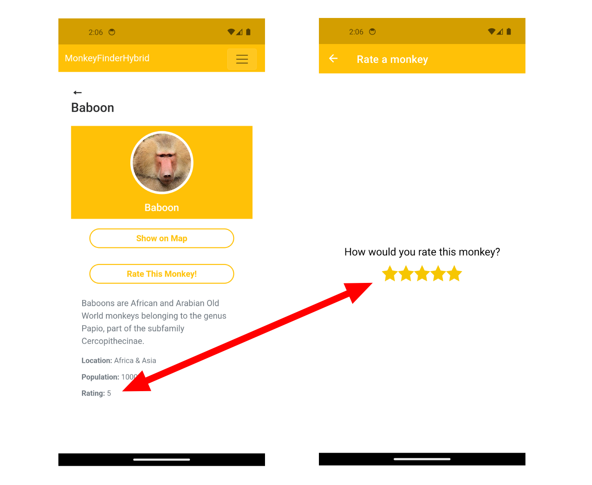

## Advanced Topics

Congratulations again! You have now mastered the basics of building a Blazor Hybrid app with .NET MAUI. But it doesn't end there. There is much more to discover!

In this part you will find some more advanced topics that might come in handy when you start building your real-world app.

This part consists of 2 more sections. The first is about sharing state between Blazor and .NET MAUI. We have already seen how we can navigate between Razor pages and .NET MAUI pages, but there is more to explore here in terms of sharing state between the two. Here we will implement the monkey rating functionality.

For the second part we will look at how to create a reusable Razor component that you can reuse in your own project, across different projects or even distribute as a library that others can use.

## Sharing State

For this workshop we have been working on a "full hybrid" app. By which we mean that the .NET MAUI `BlazorWebView` control fills the entire screen and you build your app with mostly (or even entirely) with Blazor. We have also learned how you can combine Blazor and .NET MAUI components in the same app.

If this is something you want to explore further, you will probably need a way to share state between the .NET MAUI components and the Blazor components. That is exactly what we will learn in this section.

For this example we will share the rating values for our monkeys. If you recall, in Part 4, we implemented the navigation between Blazor Hybrid and .NET MAUI. There we created a page where we could rate a certain monkey, but we didn't actually implement capturing the rating value yet. Let's do that now!

1. To hold our state data, we're going to create a new class called `RatingState`. In Visual Studio right-click the **Model** folder and choose Add and then Class... Name the class `RatingState` and click Add.

   If you're using VS Code, just create a new file in the **Model** folder and name it **RatingState.cs**.

   When you've created the class, add the following code to it:

   ```csharp
   namespace MonkeyFinderHybrid.Model;

   public class RatingState
   {
      public Dictionary<Monkey, int> MonkeyRatings { get; } = [];
      public event EventHandler? RatingChanged;

      public void AddOrUpdateRating(Monkey monkey, int value)
      {
         if (!MonkeyRatings.TryAdd(monkey, value))
         {
               MonkeyRatings[monkey] = value;
         }

         RatingChanged?.Invoke(this, EventArgs.Empty);
      }

      public int GetRating(Monkey monkey)
      {
         if (MonkeyRatings.TryGetValue(monkey, out var rating))
         {
               return rating;
         }

         return 0;
      }
   }
   ```

   In this class we have a property `MonkeyRatings` that captures the actual rating value per monkey. Additionally, we have a `RatingChanged` event handler that we will use to notify subscribers that the value of a rating has changed. That way we can propogate updates to, for example, the user interface.

	The `MonkeyRatings` object also has 2 methods. With `AddOrUpdateRating()` we add or update a rating for a monkey. For the provided monkey we see if there is already a rating available, if not, we add it with the provided rating. If the monkey is already in our `Dictionary` then we update the rating with the provided value.
	
	Lastly, we trigger the `RatingChanged` event so subscribers are notified. In this case we do not provide any event arguments. You could also opt to create your own event arguments object that then passes on the relevant monkey and the new rating value. You might even provide the old rating value too. This is an implementation detail that is totally up to you for your own apps.

	With the `GetRating()` method we can retrieve the current rating for the provided monkey. If no rating is available, we return 0.

1. To be able to use this object, let's register the `RatingState` object as a singleton in the dependency injection container in your **MauiProgram.cs**:

   ```csharp
   builder.Services.AddSingleton<RatingState>();
   ```

   By making this a singleton you ensure that you will get the same instance both on the .NET MAUI side as well as the Blazor side, effectively sharing the same state.

1. Time to start using this new functionality in the `MonkeyRatingPage`. We first create a field that will hold a reference to our `RatingState` class. With this reference we can get the current rating for the corresponding monkey and also pass the new rating for our monkey in there.

	Add another field for the `Monkey` that has been selected to rate. Both of these will be provided through the constructor, so update the constructor to take a `Monkey` object and the `RatingState` object.

	In the constructor we finally set the provided `Monkey` and `RatingState` to the fields we have created and we set the rating control value to the current rating value for the monkey by calling `GetRating()`. By doing all this, your code should look like below:

   ```csharp
   private RatingState ratingState;
   private readonly Monkey monkeyToRate;

   public MonkeyRatingPage(Monkey monkey, RatingState ratingState)
   {
      InitializeComponent();

      this.ratingState = ratingState;
      monkeyToRate = monkey;
      rating.Value = ratingState.GetRating(monkey);
   }
   ```

1. Remember in Part 3 Navigation, how we added a button that printed out the rating value and then closed the modal page. Since we ultimately ended up implementing the regular page navigation, we removed the button and the event again. Let's see an alternative way to implement the rating callback to our Blazor Hybrid page.

   While still in the **MonkeyRatingPage.xaml.cs**, add the below code inside of the `MonkeyRatingPage` class but outside of any other methods:

   ```csharp
   protected override void OnNavigatedFrom(NavigatedFromEventArgs args)
   {
      base.OnNavigatedFrom(args);

      ratingState.AddOrUpdateRating(monkeyToRate, rating.Value);
   }
   ```

   This code overrides the (.NET MAUI) page's `OnNavigatedFrom()` method. This method is invoked by MAUI when the user navigates away from this page. The way the user navigates away does not matter in this case. That means that this works for both modal navigation as well as regular navigation!

   We leverage this to invoke the `AddOrUpdateRating()` on our state object and that will update the monkey's rating and notify subscribers that the rating value changed.

1. Go over to the **Components/Pages/DetailsPage.razor** file. Here we need to inject our `RatingState` object. We've seen this a couple of times now, do you remember how?

   That's right, add `@inject RatingState ratingState` at the top of the file. This will resolve automatically because we registered it in our `MauiProgram` a little earlier.

1. Still in the **DetailsPage.razor** page, we add a new label to display the ratings value. You can place this under the population: 

   ```html
            <!-- This is already there, everything above is omitted for brevity -->
            <p class="detailspopulation"><strong>Population:</strong> @monkey.Population</p>
            <!-- This was added -->
            <p class="detailsrating"><strong>Rating:</strong> @ratingState.GetRating(monkey)</p>
         </div>
      </div>
   </body>
   ```

1. In this same page **DetailsPage.razor**, update the navigation code in the `AddRating()` method to pass in our monkey and state object to the .NET MAUI page:

   ```csharp
   private void AddRating()
   {
      // This line was
      // ((Application)app).Windows[0].Page!.Navigation.PushAsync(new MonkeyRatingPage());

      // Now update it to, notice the ratingState variable
      ((Application)app).Windows[0].Page!.Navigation.PushAsync(new MonkeyRatingPage(monkey, ratingState));
   }
   ```

	The `ratingState` we have just added to this page and the `monkey` field was already added earlier and is populated whenever we navigate to this page.

1. Finally, to make sure that our Blazor page refreshes the rating when we show the page, we hook up the `RatingChanged` event on our state object. Do this in the `OnInitialized()` method:

   ```csharp
   protected override void OnInitialized()
   {
      monkey = monkeyService.FindMonkeyByName(Name);

      // This was added
      ratingState.RatingChanged += (_,_) => 
      {
         _ = InvokeAsync(() => StateHasChanged());
      };
   }
   ```

   This might look a little funky, but it's not that hard. The two underscores as parameters mean that we don't care about those values as we won't use them. Therefore we don't even bother to have a reference to them. This is a C# concept, not specific to any of this. Then, inside the body, we again don't care about the return value of `InvokeAsync()`. Basically we just don't care enough about these values to name them as we know we're not going to use them. By setting the variable "name" to `_` we let the compiler know we do not care and they can be discarded.

   What `InvokeAsync()` does is make sure that this runs on the main thread, this is needed to update the UI. What we want to execute on the main thread is the call to `StateHasChanged()`. This is a built-in Blazor method that re-evaluates all the data binding values. Typically this should happen automatically, but for the times that it doesn't like when you're doing something on a different thread, you can call this.

   What will happen now, is that we call `ratingState.AddOrUpdateRating(monkeyToRate, rating.Value);` from the (.NET MAUI) rating page, which triggers the event we just wired up here. The event will then tell Blazor to evaluate the bindings, including the one we just added: `<p class="detailsrating"><strong>Rating:</strong> @ratingState.Rating</p>`.

With this all in place, run the application and go add a rating. When you navigate back to the Razor page you will see that label has been updated there as well.

<p align="center">
    <picture>
        <source media="(prefers-color-scheme: dark)" srcset="../Art/SharedRating-dark.png">
        <source media="(prefers-color-scheme: light)" srcset="../Art/SharedRating-light.png">
        
    </picture>
</p>

## Creating Reusable Components

One of the superpowers of Blazor is that everything is a component. That also makes it very easy to reuse components and reusing components is what we as software developers love doing because it generally means less work.

In this section we will learn how to create a reusable component ourselves! For this workshop we will look at how to make a component more reusable and using it across our own project, but a nice exercise for you afterwards could be to see how you can then reuse it across different projects or even distribute it as a NuGet package.

Let's dive in.

1. The first thing we want to do is create a new Razor component file. In Visual Studio right-click on the **Components/Controls** folder, choose Add and then Razor Component... Name the file **MyButton.razor** and click Add.

   When using VS Code, create a new file under **Components/Controls** and simply call it **MyButton.razor**. Alternatively you could open a terminal window and do `dotnet new razorcomponent -n MyButton`.

1. Replace any content that is in this file with the code below:

   ```html
   <button class="button-yellow" @onclick="Callback">@Caption</button>

   @code {
      [Parameter]
      [EditorRequired]
      public string Caption { get; set; } = string.Empty;

      [Parameter]
      public EventCallback Callback { get; set; }
   }
   ```

   You're already a experienced Blazor engineer by now, can you see what we're doing here?

   The `<button>` might look familiar as it is the button that we have been using through the entire application. But we don't want to repeat ourselves and duplicate having that `class` attribute everywhere. If we need to updat this value later, we need to go through the whole app. It's better to just update this in 1 place. And that is exactly why we are wrapping this in a Razor component.

   To make it reusable for all of our buttons in the application, we need to make the text on the button and the method our button should call configurable.

   As we have learned earlier, we can do this by adding the `[Parameter]` attribute on top of a property field. This makes it externally settable. You can see in the HTML markup that we have references to both properties and they will update as the values will update.

   You will also notice the `[EditorRequired]` attribute. This attributes hints to the editor (so Visual Studio (Code) or any other editor that looks for this attribute) that this is a required field. When we consume this `MyButton` component and do not specify the `Caption` it will give us a warning. Note that this functionality is dependent on the editor that you are using and is in no way something to rely on for a guaranteed providing of a value.

   We also have not learned about the `EventCallback` yet. This is basically a container for the method that we want to trigger upon click. If you want to learn about it in more detail, please see the [documentation](https://learn.microsoft.com/aspnet/core/blazor/components/event-handling#eventcallback).

1. Time to consume this component! Go to your **Home.razor** and find the 2 buttons in the top of the screen.

   Replace the Add New Monkey HTML button with our new Razor component like this:

   ```html
   <!-- Added this -->
   <MyButton Caption="Add New Monkey" Callback="AddMonkey"/>
   <!-- Commented this out, @* *@ is a way to add comments in Razor -->
   @* <button class="button-yellow" @onclick="AddMonkey">Add New Monkey</button> *@
   ```

   The corresponding `@using MonkeyFinderHybrid.Components.Controls` statement is already in the **_Imports.razor**. If you are following along with your own project, make sure to add this line to the **_Imports.razor** or in the top of the file that you're adding this component to.

   While we have been using Razor components before (think of the `FluentMenuButton` from the previous part), and even created a Razor component already (the `SimpleCustomizedDialog` from Part 2), we haven't really talked about the mechanics here.

   In the above code, you will see that we use `MyButton` to specify our newly created component. That name is simply determined by the filename of the Razor component. Whatever you call the file, will be the name of your component, excluding the file extension of course. This is something we've also briefly touched upon in Part 3 already.

   Then the properties that we have added the `[Parameter]` attributes to will just become attributes in this syntax.

Run the application and notice... How absolutely nothing changed!

The "only" thing we did is wrap our button in a Razor component, the output is the exact same. However, the real value lies in what comes next.

Go through the application and find all other instances of the HTML button tag and replace them with our Razor component.

Now whenever the style needs to change, just update it in our Razor component and it will update all the buttons everywhere automatically. Of course this style change is only a very minimal example, but imagine that you have a more complex control that you want to use in several places, this can be really powerful and convenient then.

As a bonus exercise you might want to try and add CSS isolation to this to style the component with that. This is not part of this workshop, but with what you have learned so far, you should be able to attempt this on your own.

### Reusing Reusable Components

With what you learned above, you can now reuse your component inside of your project which already adds a lot of value.

But as your application grows, you might want to divide things up into different projects. Maybe you will even bring your Blazor Hybrid app to the web!

Then you can lift this Razor component from this single project, put it in its own project and then reference that project from multiple other projects. This way you can use your `MyButton` in all of your Blazor projects.

Again, the `MyButton` example is fairly simple. If you're going to build more complex components there is more to consider. That goes beyond the scope of this workshop, but I just want to give you a heads up about sharing this with a Blazor web app.

Sharing components between different Blazor Hybrid projects shouldn't be much of a problem as long as they are built on top of .NET MAUI. The same foundations will apply and when you use a .NET MAUI API that will still work.

However, if you're bringing components to the web, things might become a bit more complex.

Image that your component queries the devices' geolocation. We have seen how to do that with .NET MAUI. However, those .NET MAUI APIs will not work in a Blazor web application. There you will want to leverage the browser's built-in location services.

To overcome this, you probably want to inject a service into your component that knows how to do that. The implementation of that service will be different between running on a mobile device and running in the browser.

The term "inject" probably already triggered you to think of dependency injection. That is exactly what you could use for this. Remember, dependency injection at its core just means you provide the receiver with the dependency it nees to do the job. It says nothing about how a dependency is resolved.

In its simplest form you can create a property on your component with an interface that describes your location service. Then using Blazor Hybrid you inject a concrete implementation using .NET MAUI, and in the browser you inject a concrete implementation that uses browser APIs.

Inject in this case means: assign an instance of a class that implements the interface to the property of your component.

It might sound a little abstract like this, if you start playing around with it, it will all become clear. Or read more on this concept in the [documentation](https://learn.microsoft.com/aspnet/core/razor-pages/ui-class).

### Reusing UI across Blazor Hybrid and Blazor web

As mentioned; you can even reuse your code to the web. There is no web target in .NET MAUI, but with what we have just learned you can still share a lot of code between the separate Blazor Hybrid project and Blazor web project.

To make this easier, there is a documentation page on how to setup your solution to have both of these projects and maximize code sharing. This also describes the dependency injection we talked about just above here. You can find this page here: [Build a .NET MAUI Blazor Hybrid app with a Blazor Web App](https://aka.ms/maui-blazor-web).

As of .NET 9 there will be a template provided for this setup.

## Congratulations! What's Next?

Amazing work, congratulations! You went above and beyond building your very first Blazor Hybrid app.

We think this workshop teaches you all the things necessary to start developing your own app idea now. If you have any feedback, please feel free to open an [issue](/issues), or a [pull request](/pulls) with improvements.

If you're not done learning yet, find some additional resources below that you can use to develop your app even further.

Thank you so much for joining this workshop!

### Additional Resources

| Name | Description | Link |
| ---- | ----------- | ---- |
| .NET MAUI Workshop | A workshop just like this one, building the same app but now with just .NET MAUI. Very useful to learn about the differences and similarities when using Blazor Hybrid or .NET MAUI. | [GitHub](https://github.com/dotnet-presentations/dotnet-maui-workshop) |
| Update App Icon | You might have noticed the app icon of this app is still the default template one. Learn here how to change that using .NET MAUI. | [Microsoft Learn](https://learn.microsoft.com/dotnet/maui/user-interface/images/app-icons) |
| Update Splash Screen | You might have noticed the splash screen of this app is still the default template one. Learn here how to change that using .NET MAUI. | [Microsoft Learn](https://learn.microsoft.com/dotnet/maui/user-interface/images/splashscreen) |
| Deploy Your App | When your app is done, it's time to think about releasing it. Under this link you can read more about the different ways to do that for the different platforms. | [Microsoft Learn](https://learn.microsoft.com/dotnet/maui/deployment/) |
